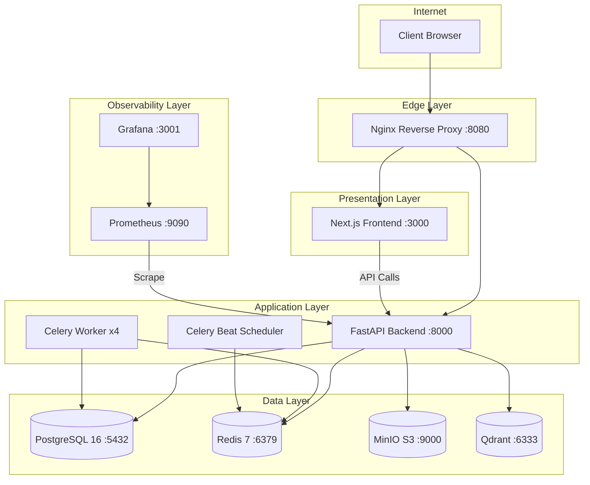
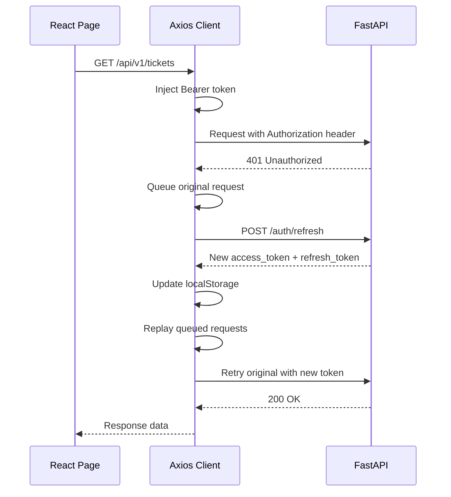
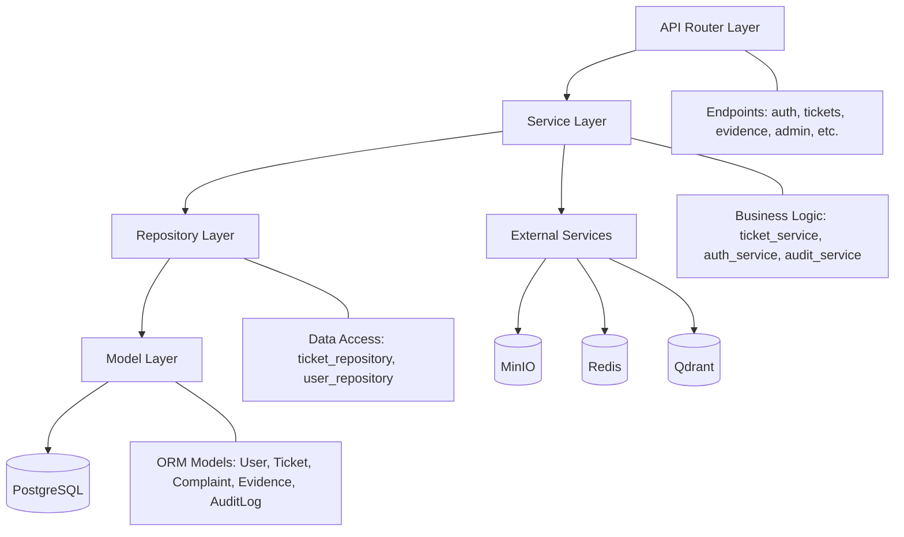
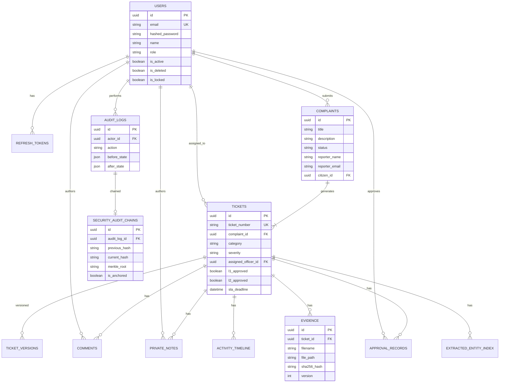
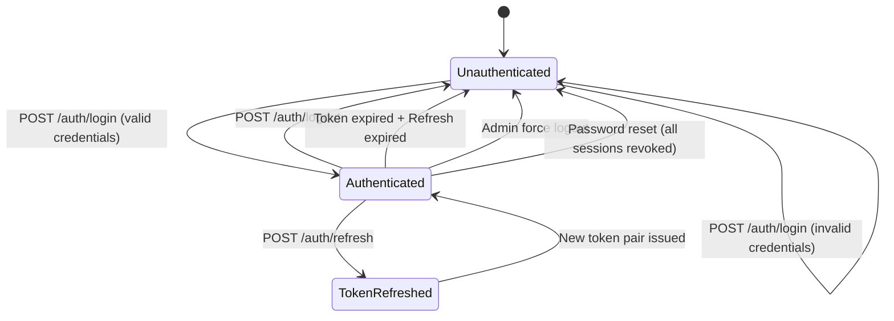
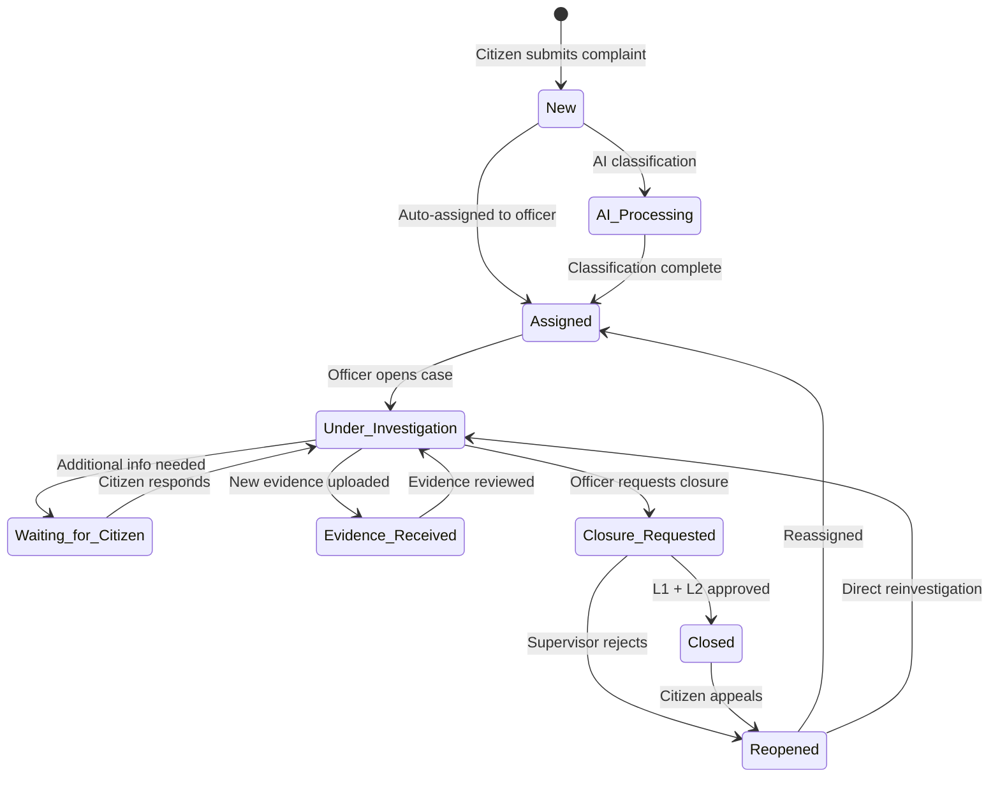
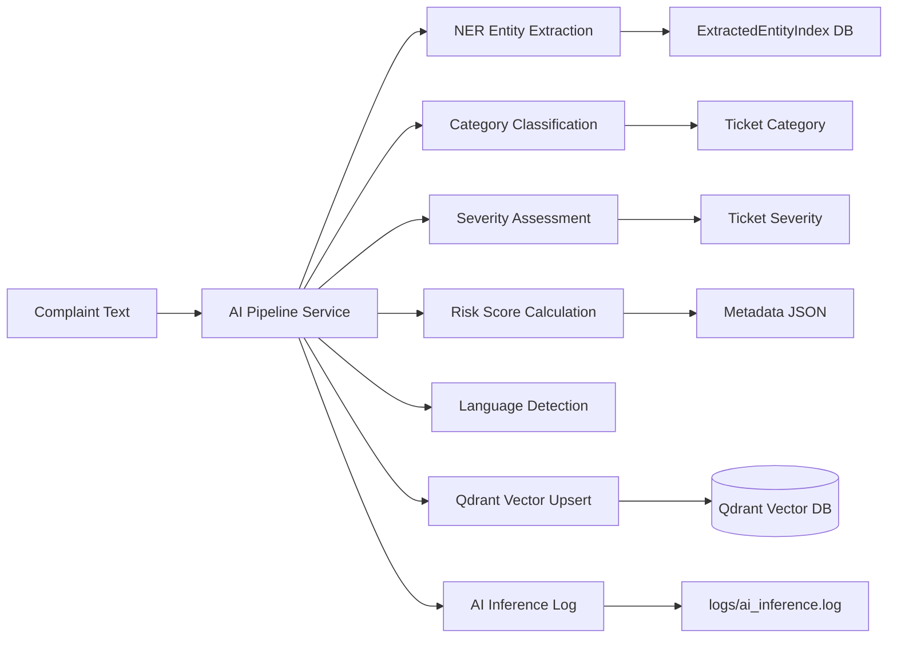
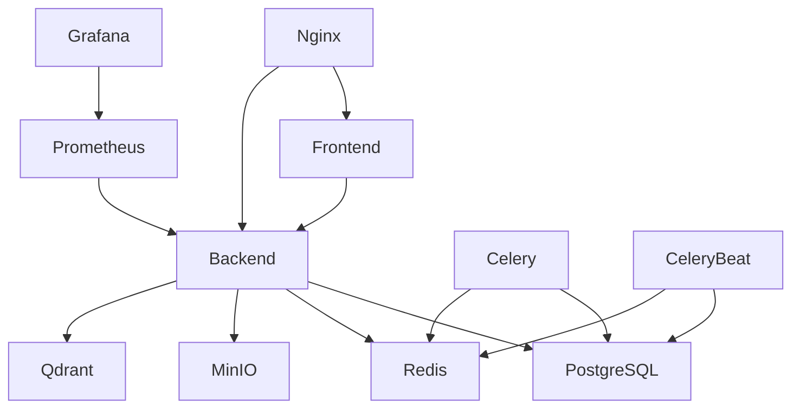

# CCGP — Architecture Review Report

**Document Classification:** CONFIDENTIAL — Internal Use Only  
**Report Version:** 1.0  
**Assessment Date:** July 16, 2026  
**Prepared By:** Enterprise Architecture Review Team  
**Prepared For:** Cyber Complaint Governance Platform (CCGP)

---

## Executive Summary

This report provides a comprehensive architecture review of the Cyber Complaint Governance Platform (CCGP). The platform is a microservices-influenced, Docker-orchestrated application comprising 11 containerized services that deliver a complete cyber crime complaint management system.

The architecture follows a three-tier model (Presentation, Application, Data) with clear separation of concerns. The backend employs a layered architecture (Router → Service → Repository → Model) consistent with enterprise patterns. AI/ML capabilities are integrated directly into the complaint intake pipeline, and a dedicated cryptographic audit system provides tamper-evident logging.

**Architecture Rating: 8.2/10 — Production-capable with identified improvement areas**

---

## 1. High-Level Architecture

The CCGP platform consists of:
- **Frontend:** Next.js 14 (React) single-page application
- **Backend:** FastAPI (Python 3.13) REST API
- **Workers:** Celery distributed task queue (worker + beat scheduler)
- **Data Layer:** PostgreSQL 16, Redis 7, MinIO, Qdrant
- **Infrastructure:** Nginx reverse proxy, Prometheus, Grafana
- **Orchestration:** Docker Compose v3.8

### 1.1 Architecture Diagram



---

## 2. Frontend Architecture

### 2.1 Technology Stack

| Component | Technology |
|---|---|
| Framework | Next.js 14 (App Router) |
| Language | TypeScript |
| HTTP Client | Axios with interceptors |
| State Management | React useState/useEffect (local state) |
| Styling | CSS Modules |
| Build Target | Standalone output |

### 2.2 Route Structure

The frontend uses Next.js App Router with route groups for role-based layouts:

```
frontend/app/
├── (auth)/           # Public authentication pages
│   ├── auth/login/
│   └── auth/register/
├── (citizen)/        # Citizen workspace
│   └── citizen/
│       ├── dashboard/
│       └── complaints/new/
├── (officer)/        # Officer workspace
│   └── officer/
│       ├── workspace/
│       ├── evidence/
│       └── threat-intel/
├── (supervisor)/     # Supervisor workspace
│   └── supervisor/
│       ├── approvals/
│       └── sla/
├── (admin)/          # Admin workspace
│   └── admin/
│       ├── dashboard/
│       ├── users/
│       ├── reports/
│       ├── health/
│       ├── system/
│       └── governance/
└── layout.tsx        # Root layout
```

### 2.3 API Client Architecture

**Source:** `frontend/lib/api.ts`

The centralized Axios client implements:
- **Request Interceptor:** Automatically injects JWT access token from `localStorage`
- **Response Interceptor:** Handles 401 responses with automatic refresh token rotation
- **Queue System:** Queues failed requests during token refresh to prevent race conditions
- **Session Expiry:** Redirects to login page when refresh token is also invalid



---

## 3. Backend Architecture

### 3.1 Layered Architecture



### 3.2 Module Structure

```
backend/app/
├── api/v1/
│   ├── router.py           # Central route aggregator
│   └── endpoints/
│       ├── auth.py          # Login, refresh, logout, reset
│       ├── users.py         # Registration, profile
│       ├── tickets.py       # Ticket CRUD, workflow
│       ├── complaints.py    # Public intake
│       ├── evidence.py      # Upload, download, metadata
│       ├── approvals.py     # L1/L2 supervisor approvals
│       ├── officer.py       # Officer workspace APIs
│       ├── supervisor.py    # Supervisor workspace APIs
│       ├── admin.py         # Admin dashboard, user mgmt, config
│       ├── audit.py         # Audit chain verification
│       ├── governance.py    # Executive governance dashboard
│       ├── threat_intel.py  # Threat intelligence lookup
│       ├── email.py         # Email automation
│       └── health.py        # Health check probe
├── core/
│   ├── config.py            # Settings (Pydantic BaseSettings)
│   ├── security.py          # JWT, bcrypt, RBAC
│   ├── database.py          # SQLAlchemy engine + Redis client
│   ├── exceptions.py        # Unified error handling
│   ├── logging.py           # JSON structured logging + SIEM
│   └── celery_app.py        # Celery configuration
├── models/
│   ├── user.py              # User, RefreshToken, EmailVerification, PasswordReset
│   ├── ticket.py            # Complaint, Ticket, TicketVersion, Comment, PrivateNote, Timeline, Approval
│   ├── evidence.py          # Evidence file metadata
│   ├── audit.py             # AuditLog, SecurityAuditChain
│   ├── threat_intel.py      # ExtractedEntityIndex, ThreatIntelScan
│   ├── notification.py      # InAppNotification
│   └── config.py            # SystemConfig
├── services/
│   ├── auth.py              # Authentication + session management
│   ├── user.py              # User lifecycle
│   ├── ticket.py            # Complaint + ticket workflow engine
│   ├── evidence.py          # Evidence upload/download/hashing
│   ├── audit.py             # Cryptographic audit chain
│   ├── approval.py          # L1/L2 closure approval logic
│   ├── ai_pipeline.py       # NLP classification + entity extraction
│   ├── threat_intel.py      # External threat intelligence APIs
│   └── notification.py      # Email/in-app notifications
└── repositories/
    ├── user.py              # User data access
    └── ticket.py            # Ticket data access
```

---

## 4. API Layer

### 4.1 Endpoint Groups

| Prefix | Tag | Endpoints | Auth Required |
|---|---|---|---|
| `/api/v1/health` | Diagnostics | 1 | No |
| `/api/v1/auth` | Authentication | 6 | Partial |
| `/api/v1/users` | User Management | 3 | Yes (citizen+) |
| `/api/v1/tickets` | Tickets and Workflows | 12+ | Yes (citizen+) |
| `/api/v1/complaints` | Public Intake | 1 | No |
| `/api/v1/evidence` | Evidence Storage | 5 | Yes (citizen+) |
| `/api/v1/approvals` | Closure Approvals | 3 | Yes (supervisor) |
| `/api/v1/officer` | Officer Portals | 5+ | Yes (officer) |
| `/api/v1/supervisor` | Supervisor Portals | 5+ | Yes (supervisor) |
| `/api/v1/email` | Email Automation | 2+ | Yes (admin) |
| `/api/v1/threat-intel` | Threat Intelligence | 3 | Yes (officer) |
| `/api/v1/audit` | Cryptographic Auditing | 4 | Yes (auditor) |
| `/api/v1/governance` | Executive Governance | 2+ | Yes (admin) |
| `/api/v1/admin` | Administrative Portals | 20+ | Yes (admin) |

### 4.2 Response Format

All API responses follow a standardized envelope:

```json
{
    "success": true,
    "data": { ... },
    "error": null
}
```

Error responses:

```json
{
    "success": false,
    "data": null,
    "error": {
        "code": "ERROR_CODE",
        "message": "Human readable message",
        "details": {}
    }
}
```

---

## 5. Database Layer

### 5.1 Entity-Relationship Diagram



### 5.2 Key Design Decisions

| Decision | Rationale |
|---|---|
| UUID primary keys | Prevents enumeration attacks; globally unique |
| Soft delete (is_deleted flag) | Preserves investigation data integrity |
| JSON columns (metadata_json, before_state, after_state) | Flexible extensibility without schema migrations |
| Cascade deletes on tickets | Ensures referential integrity when complaints are removed |
| SET NULL on user deletion | Preserves historical records while removing PII link |

---

## 6. Authentication Flow



---

## 7. Complaint Workflow

### 7.1 State Machine



### 7.2 Closure Requirements

| Condition | Requirement |
|---|---|
| L1 Approval | Supervisor must approve with comment |
| L2 Approval | Supervisor must approve with comment (after L1) |
| Both Required | Ticket cannot transition to "Closed" without both L1 and L2 |
| Reopen Resets | Reopening a ticket resets both L1 and L2 approval flags |

---

## 8. Officer Workflow

The officer workspace provides:

| Feature | Implementation |
|---|---|
| Ticket Queue | Filtered list of assigned tickets |
| Status Transitions | Under Investigation, Waiting, Closure Requested |
| Evidence Vault | Upload/download/verify evidence files |
| Private Notes | Officer-only investigation memos |
| AI Analysis | On-demand AI classification and entity extraction |
| Threat Intelligence | External API lookups (AbuseIPDB, VirusTotal, OTX) |
| Case Report | PDF generation with investigation summary |

---

## 9. Supervisor Workflow

| Feature | Implementation |
|---|---|
| Pending Approvals | Queue of tickets in "Closure Requested" status |
| L1 Approval | First-level review with mandatory comment |
| L2 Approval | Second-level review with mandatory comment |
| Rejection | Sends ticket back to "Reopened" status |
| SLA Monitoring | Dashboard of SLA breach statistics |
| Officer Oversight | View officer workloads and assignments |

---

## 10. Admin Workflow

| Feature | Implementation |
|---|---|
| Dashboard | Aggregate statistics, trends, KPIs |
| User Management | Create, update, lock, unlock, delete users |
| Role Assignment | Change user roles via admin API |
| CSV Export | Authenticated download of user directory |
| Compliance Reports | PDF/CSV generation of compliance data |
| System Health | Real-time connection probes to all dependencies |
| Configuration | Dynamic system configuration profiles |
| Audit Logs | View, verify, and export cryptographic audit chain |
| Governance | Executive governance workspace and dashboards |
| Departments | Cyber cell and department management |

---

## 11. AI Components

### 11.1 AI Pipeline Architecture



### 11.2 AI Capabilities

| Capability | Implementation | Storage |
|---|---|---|
| Text Classification | Keyword-based + HuggingFace embeddings | Ticket category field |
| Named Entity Recognition | Pattern-based extraction (IPs, URLs, emails, phones, UPI IDs) | ExtractedEntityIndex table |
| Severity Assessment | Rule-based (financial amount, keyword severity) | Ticket severity field |
| Risk Scoring | Composite score (0-100) based on category, entities, amount | Metadata JSON |
| Similarity Search | Sentence-transformers embeddings → Qdrant | Qdrant vector collection |
| Language Detection | Keyword and character pattern analysis | Metadata JSON |

---

## 12. Threat Intelligence Components

| Source | Integration | Authentication |
|---|---|---|
| AbuseIPDB | REST API v2 | API key (environment variable) |
| VirusTotal | REST API v3 | API key (environment variable) |
| AlienVault OTX | REST API v2 | API key (environment variable) |

Threat intelligence results are stored as `ThreatIntelScan` records linked to tickets.

---

## 13. Docker Architecture

### 13.1 Service Topology

| Container | Image | Port | Purpose | Health Check |
|---|---|---|---|---|
| `ccgp_db` | postgres:16-alpine | 5433:5432 | Primary database | pg_isready |
| `ccgp_redis` | redis:7-alpine | 6379:6379 | Cache + message broker | redis-cli ping |
| `ccgp_minio` | minio/minio:latest | 9000, 9001 | Object storage (evidence) | HTTP /minio/health/live |
| `ccgp_qdrant` | qdrant/qdrant:v1.9.3 | 6333, 6334 | Vector search | — |
| `ccgp_backend` | Custom (Dockerfile) | 8000 | FastAPI application | — |
| `ccgp_frontend` | Custom (Dockerfile) | 3000 | Next.js application | — |
| `ccgp_celery` | Custom (backend) | — | Background task worker | — |
| `ccgp_celery_beat` | Custom (backend) | — | Scheduled task runner | — |
| `ccgp_nginx` | nginx:1.25-alpine | 8080:80 | Reverse proxy / load balancer | — |
| `ccgp_prometheus` | prom/prometheus:v2.51.0 | 9090 | Metrics collection | — |
| `ccgp_grafana` | grafana/grafana:10.4.0 | 3001:3000 | Monitoring dashboards | — |

### 13.2 Dependency Graph



### 13.3 Volume Persistence

| Volume | Mounted To | Purpose |
|---|---|---|
| `pgdata` | `/var/lib/postgresql/data` | Database persistence |
| `redisdata` | `/data` | Redis AOF/RDB persistence |
| `miniodata` | `/data` | Evidence file persistence |
| `qdrantdata` | `/qdrant/storage` | Vector index persistence |
| `prometheusdata` | `/prometheus` | Metrics time-series data |
| `grafanadata` | `/var/lib/grafana` | Dashboard configurations |

---

## 14. Deployment Architecture

### 14.1 Current (Development)

```
                 ┌─────────────┐
    Port 8080 ───│   Nginx     │
                 └──────┬──────┘
                        │
              ┌─────────┴─────────┐
    Port 3000 │   Frontend        │  Port 8000 │   Backend     │
              └───────────────────┘            └───────────────┘
                                                      │
                  ┌──────────┬──────────┬─────────────┘
                  │          │          │
            ┌─────┴──┐ ┌────┴───┐ ┌────┴───┐ ┌───────┐
            │Postgres│ │ Redis  │ │ MinIO  │ │Qdrant │
            └────────┘ └────────┘ └────────┘ └───────┘
```

### 14.2 Production Recommendations

| Component | Current | Recommended |
|---|---|---|
| Database | Single Docker container | Managed PostgreSQL (RDS/Cloud SQL) with replication |
| Cache | Single Redis | Redis Cluster or managed ElastiCache |
| Object Storage | Docker MinIO | Managed S3-compatible service |
| Load Balancer | Nginx container | Cloud Load Balancer with TLS termination |
| Backend | Single container | Kubernetes Deployment (3+ replicas) |
| Frontend | Single container | CDN-backed static deployment |
| Monitoring | Docker Prometheus/Grafana | Managed monitoring (CloudWatch, Datadog) |

---

## 15. Scalability Review

| Component | Current Scalability | Bottleneck | Recommendation |
|---|---|---|---|
| Backend API | Single instance | CPU/memory | Horizontal scaling behind load balancer |
| Celery Worker | concurrency=4 | Worker count | Add more worker containers |
| PostgreSQL | Single instance | Disk I/O, connections | Read replicas, connection pooling |
| Redis | Single instance | Memory | Redis Cluster |
| MinIO | Single instance | Storage | Distributed MinIO or S3 |
| Qdrant | Single instance | Memory | Qdrant cluster mode |

---

## 16. Maintainability

| Aspect | Rating | Evidence |
|---|---|---|
| Code Organization | 9/10 | Clear layered architecture (Router → Service → Repository → Model) |
| Separation of Concerns | 9/10 | Business logic in services, not in endpoints |
| Configuration Management | 8/10 | Pydantic BaseSettings with env file support |
| Error Handling | 9/10 | Centralized exception handlers with consistent responses |
| Logging | 8/10 | Structured JSON logging with request ID correlation |
| Testing | 7/10 | 31 automated tests; could expand coverage |
| Documentation | 7/10 | OpenAPI docs auto-generated; architecture docs being created |

---

## 17. Design Patterns

| Pattern | Usage |
|---|---|
| Repository Pattern | `ticket_repository`, `user_repository` abstract data access |
| Service Layer Pattern | Business logic encapsulated in service classes |
| Dependency Injection | FastAPI `Depends()` for DB sessions, Redis, auth |
| Singleton Pattern | Service instances (`audit_service`, `evidence_service`) |
| Observer Pattern | Activity timeline events on state changes |
| State Machine | Ticket status transitions with role-based guards |
| Interceptor Pattern | Axios request/response interceptors for auth |
| Factory Pattern | Token creation functions (`create_access_token`, `create_refresh_token`) |

---

## 18. Technical Debt

| Item | Severity | Description |
|---|---|---|
| Duplicate delete endpoint | Low | Two `DELETE /users/{id}` routes defined in `admin.py` |
| Thread-based vector upsert | Medium | Uses Python threading instead of Celery task for Qdrant |
| No database migrations | Medium | Schema created via `create_all()`; Alembic migrations not set up |
| Hard-coded assignment rules | Low | Category-to-group mappings in code instead of database configuration |
| localStorage for tokens | Medium | Should migrate to httpOnly cookies for XSS protection |

---

## 19. Strengths

1. **Clean layered architecture** with clear separation of Router, Service, Repository, and Model layers
2. **Comprehensive RBAC** with 8-level hierarchical role system
3. **Cryptographic audit trail** with SHA-256 hash chain and Merkle tree anchoring
4. **AI-integrated pipeline** for automatic complaint classification and entity extraction
5. **Complete Docker orchestration** with 11 services, health checks, and persistent volumes
6. **Monitoring stack** with Prometheus metrics collection and Grafana dashboards
7. **Standardized API responses** with consistent error handling
8. **Evidence integrity** with SHA-256 client-server hash verification
9. **Dual approval workflow** (L1 + L2) preventing unilateral case closure
10. **Production credential validator** preventing default secrets in production

---

## 20. Weaknesses

1. No database migration tool (Alembic) — schema changes require manual intervention
2. No automated CI/CD pipeline configured
3. Single-instance deployment — no horizontal scaling or failover
4. Frontend uses localStorage for JWT storage (XSS vulnerability surface)
5. No WebSocket implementation for real-time updates
6. Test coverage could be expanded (31 tests for a complex system)

---

## 21. Improvement Recommendations

| # | Recommendation | Priority | Effort |
|---|---|---|---|
| ARCH-1 | Add Alembic database migrations | High | Medium |
| ARCH-2 | Implement CI/CD pipeline (GitHub Actions) | High | Medium |
| ARCH-3 | Migrate to Kubernetes for production orchestration | Medium | High |
| ARCH-4 | Add WebSocket support for real-time dashboard updates | Medium | Medium |
| ARCH-5 | Implement API versioning strategy | Low | Low |
| ARCH-6 | Replace thread-based Qdrant upsert with Celery task | Low | Low |
| ARCH-7 | Add OpenTelemetry distributed tracing | Medium | Medium |
| ARCH-8 | Implement caching layer for dashboard statistics | Low | Low |
| ARCH-9 | Add automated integration test suite | High | Medium |
| ARCH-10 | Implement feature flag system via database configuration | Low | Low |

---

*End of Architecture Review Report*
