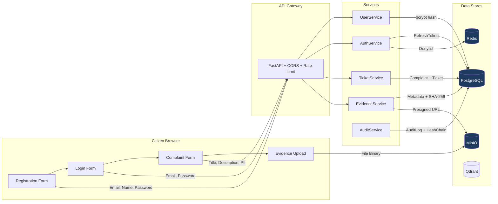
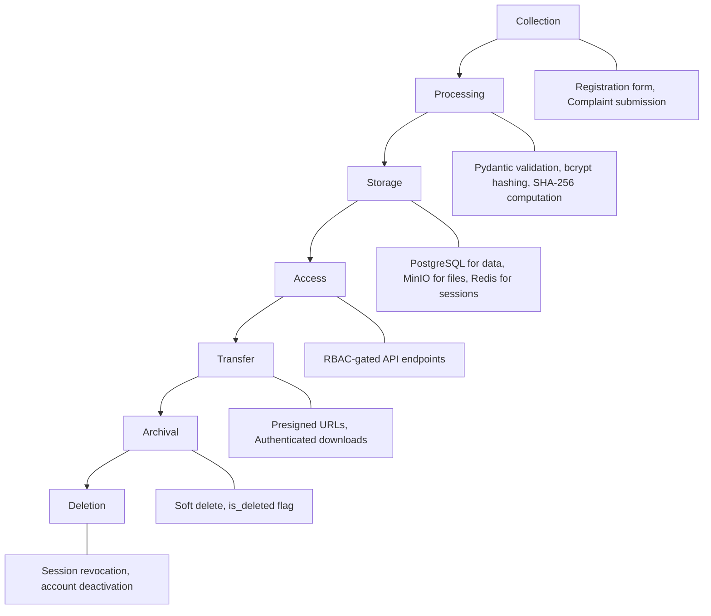

# CCGP — Data Protection and Privacy Report

**Document Classification:** CONFIDENTIAL — Internal Use Only  
**Report Version:** 1.0  
**Assessment Date:** July 16, 2026  
**Prepared By:** Enterprise Data Protection and Privacy Review Team  
**Prepared For:** Cyber Complaint Governance Platform (CCGP)

---

## Executive Summary

This report evaluates how the Cyber Complaint Governance Platform (CCGP) protects citizen data, personal information, and sensitive evidence throughout the complaint lifecycle. The platform processes Personally Identifiable Information (PII) including names, email addresses, phone numbers, and cyber crime evidence, making data protection a critical concern.

**Key Findings:**
- Citizen passwords are securely hashed using bcrypt with automatic salting
- JWT tokens implement rotation and revocation, preventing persistent unauthorized access
- Evidence files are stored in isolated object storage (MinIO) with SHA-256 integrity verification
- File exports are secured with Bearer token authentication (Phase 8 fix)
- Audit logging creates a tamper-evident SHA-256 hash chain for accountability
- User deletion is implemented as soft delete with session revocation
- No plaintext credentials are ever stored or logged

**Overall Privacy Assessment: ADEQUATE for controlled deployment**

---

## 1. Data Classification

### 1.1 Data Categories

| Classification | Data Type | Storage Location | Examples |
|---|---|---|---|
| **Restricted** | Authentication Credentials | PostgreSQL (hashed) | Passwords (bcrypt), JWT secrets |
| **Confidential** | Citizen PII | PostgreSQL | Name, email, phone |
| **Confidential** | Complaint Details | PostgreSQL | Crime descriptions, evidence metadata |
| **Confidential** | Evidence Files | MinIO Object Storage | Documents, images, screenshots |
| **Internal** | Officer Notes | PostgreSQL | Private investigation notes |
| **Internal** | Audit Logs | PostgreSQL | System events, hash chains |
| **Internal** | AI Analysis Results | PostgreSQL + Qdrant | Classifications, entity extractions |
| **Public** | System Health | API Response | Service connectivity status |

### 1.2 Sensitivity Matrix

| Data Element | Sensitivity | Encryption at Rest | Encryption in Transit | Access Control |
|---|---|---|---|---|
| User passwords | Critical | bcrypt hash (irreversible) | HTTPS (when configured) | Never exposed via API |
| JWT Secret | Critical | Environment variable | Not transmitted | Server-side only |
| Citizen email | High | PostgreSQL storage | HTTPS (when configured) | Owner + Admin |
| Citizen phone | High | PostgreSQL storage | HTTPS (when configured) | Owner + Admin |
| Complaint description | High | PostgreSQL storage | HTTPS (when configured) | Owner + Assigned Officer + Supervisor + Admin |
| Evidence files | High | MinIO storage | Presigned URLs (time-limited) | Owner + Assigned Officer + Supervisor |
| Private notes | Medium | PostgreSQL storage | HTTPS (when configured) | Authoring officer only |
| Audit records | Medium | PostgreSQL + hash chain | HTTPS (when configured) | Security Auditor + Admin |

---

## 2. Personally Identifiable Information (PII)

### 2.1 PII Inventory

| Field | Model | Column | Max Length | Nullable |
|---|---|---|---|---|
| `name` | `User` | `users.name` | 255 chars | No |
| `email` | `User` | `users.email` | 255 chars | No |
| `reporter_name` | `Complaint` | `complaints.reporter_name` | 255 chars | No |
| `reporter_email` | `Complaint` | `complaints.reporter_email` | 255 chars | Yes |
| `reporter_phone` | `Complaint` | `complaints.reporter_phone` | 50 chars | Yes |
| `department` | `User` | `users.department` | 255 chars | Yes |
| `jurisdiction` | `User` | `users.jurisdiction` | 255 chars | Yes |

**Source:** `backend/app/models/user.py` and `backend/app/models/ticket.py`

### 2.2 PII Access Matrix

| PII Field | Citizen | Officer | Supervisor | Admin |
|---|---|---|---|---|
| Own name/email | ✅ Read/Write | — | — | ✅ Read/Write |
| Own phone | ✅ Read/Write | — | — | ✅ Read/Write |
| Complainant name | ✅ Own only | ✅ Assigned cases | ✅ All cases | ✅ All cases |
| Complainant email | ✅ Own only | ✅ Assigned cases | ✅ All cases | ✅ All cases |
| Complainant phone | ✅ Own only | ✅ Assigned cases | ✅ All cases | ✅ All cases |
| Other citizen data | ❌ | ❌ | ❌ | ✅ User directory |

---

## 3. Data Flow Diagram



---

## 4. Data Lifecycle

### 4.1 Lifecycle Stages



### 4.2 Data at Each Stage

| Stage | Data Processed | Protection |
|---|---|---|
| **Collection** | PII, credentials, evidence | Pydantic schema validation, HTTPS (when configured) |
| **Processing** | Passwords → bcrypt hash; Evidence → SHA-256 | Irreversible hashing, server-side verification |
| **Storage** | All structured data | PostgreSQL with parameterized queries; MinIO isolated storage |
| **Access** | Query results, evidence URLs | JWT authentication, RBAC hierarchy, presigned URLs |
| **Transfer** | API responses, file downloads | Bearer token enforcement, time-limited URLs |
| **Archival** | Soft-deleted records | `is_deleted=True`, `is_active=False` flags preserved |
| **Deletion** | User accounts | Soft delete + all refresh tokens revoked |

---

## 5. Encryption Analysis

### 5.1 Data at Rest

| Data Store | Encryption Mechanism | Status |
|---|---|---|
| PostgreSQL (passwords) | bcrypt with automatic salt (12 rounds) | ✅ Encrypted |
| PostgreSQL (PII fields) | No column-level encryption | ⚠️ Relies on filesystem/disk encryption |
| MinIO (evidence files) | No server-side encryption configured | ⚠️ Relies on disk encryption |
| Redis (session cache) | No encryption | ⚠️ Volatile store, TTL-bounded |

### 5.2 Data in Transit

| Path | Protocol | Encryption | Status |
|---|---|---|---|
| Client → Frontend (Next.js) | HTTPS (when TLS configured) | TLS 1.2/1.3 | ⚠️ Requires Nginx TLS setup |
| Frontend → Backend API | HTTP (localhost in dev) | None in development | ⚠️ Must enable in production |
| Backend → PostgreSQL | TCP within Docker network | Not encrypted | ⚠️ Internal Docker bridge |
| Backend → MinIO | HTTP (MINIO_SECURE=false) | None | ⚠️ Must enable in production |
| Backend → Redis | TCP within Docker network | Not encrypted | ⚠️ Internal Docker bridge |
| Backend → Qdrant | HTTP within Docker network | Not encrypted | ⚠️ Internal Docker bridge |

> **IMPORTANT:** All inter-service communication occurs within the Docker bridge network, which provides network-level isolation. However, TLS should be enabled for production deployments, especially for the client-facing edge (Nginx → Frontend → Backend).

---

## 6. Password Hashing

**Source:** `backend/app/core/security.py` lines 30-44

### 6.1 Implementation Details

```
Algorithm:    bcrypt (Blowfish-based adaptive hash)
Salt:         Automatically generated via bcrypt.gensalt()
Work Factor:  12 rounds (default)
Output:       60-character encoded string stored in users.hashed_password
```

### 6.2 Security Properties

| Property | Status |
|---|---|
| Irreversible (one-way) | ✅ Cannot recover plaintext from hash |
| Salted (unique per password) | ✅ bcrypt.gensalt() generates unique salt |
| Adaptive (configurable work factor) | ✅ Can increase rounds for future proofing |
| Constant-time comparison | ✅ bcrypt.checkpw prevents timing attacks |
| Resistant to rainbow tables | ✅ Per-password salt eliminates precomputation |
| Resistant to GPU brute-force | ✅ bcrypt is memory-hard (Blowfish Expensive Key Setup) |

---

## 7. Access Controls

### 7.1 Principle of Least Privilege

| Role | Can Access |
|---|---|
| **Citizen** | Only their own complaints, tickets, and evidence |
| **Officer** | Only assigned ticket workspace |
| **Supervisor** | Pending approvals queue (not raw data exploration) |
| **Admin** | User directory, system configuration, aggregate statistics |
| **Security Auditor** | Audit logs and chain verification only |

### 7.2 Technical Enforcement

- **API Level:** `RoleRequirement` dependency checks JWT role claim against `ROLE_HIERARCHY`
- **Database Level:** Foreign key constraints enforce referential integrity
- **Object Storage Level:** Presigned URLs scoped to specific object paths with time expiry
- **Frontend Level:** Route guards redirect unauthorized navigation attempts

---

## 8. Privacy Controls

### 8.1 Data Minimization

| Control | Implementation |
|---|---|
| Required fields | Only name, email, password for registration |
| Optional fields | Phone, department, jurisdiction are nullable |
| Complaint metadata | JSON field for extensible but non-mandatory data |
| Evidence metadata | Only filename, MIME type, size, and hash stored (not file content in DB) |

### 8.2 Purpose Limitation

| Data | Stated Purpose | Alternative Use Prevention |
|---|---|---|
| Email | Authentication, notifications | RBAC prevents unauthorized query |
| Phone | Complainant contact | Not used in search or analytics |
| Evidence | Crime investigation | Presigned URL access only, not direct filesystem |
| Private Notes | Officer investigation memo | Restricted to authoring officer; not exposed to citizens |

---

## 9. Data Retention

### 9.1 Current Implementation

| Data Type | Retention Policy | Mechanism |
|---|---|---|
| User accounts | Indefinite (soft delete available) | `is_deleted` flag, no hard delete |
| Complaints | Indefinite | No auto-purge mechanism |
| Tickets | Indefinite | No auto-purge mechanism |
| Evidence files | Indefinite | Stored in MinIO persistent volume |
| Audit logs | Indefinite | Required for compliance; hash chain prevents deletion |
| Refresh tokens | 7 days active, then revoked | `is_revoked=True`, no auto-cleanup job |
| Redis denylist | TTL matching token expiry | Automatic Redis key expiration |

### 9.2 Recommendations

| Recommendation | Priority |
|---|---|
| Implement configurable data retention policies per data category | Medium |
| Add scheduled job to purge expired/revoked refresh tokens | Low |
| Add evidence archival workflow for closed cases (move to cold storage) | Medium |
| Implement right-to-erasure workflow for citizen data (GDPR/DPDP compliance) | Medium |

---

## 10. Auditability

### 10.1 Audit Trail Coverage

| Event | Actor Tracked | Target Tracked | Before/After State |
|---|---|---|---|
| UserRegister | ✅ User ID | ✅ User ID | ⚠️ Partial |
| UserLogin | ✅ User ID | ✅ User ID | — |
| ComplaintCreate | ✅ User ID | ✅ Ticket ID | ⚠️ Partial |
| TicketStatusChanged | ✅ User ID | ✅ Ticket ID | ✅ Full (old/new status) |
| L1Approved | ✅ Approver ID | ✅ Ticket ID | ✅ Full |
| L2Approved | ✅ Approver ID | ✅ Ticket ID | ✅ Full |

### 10.2 Tamper-Evidence

The `SecurityAuditChain` model creates a linked hash chain:

```
Entry N: SHA-256(prev_hash | log_id | actor | action | target | before | after | timestamp)
         ↓
Entry N+1: SHA-256(entry_N_hash | ...)
```

Any modification or deletion of an intermediate record breaks the hash chain, which is detected by `verify_chain_integrity()`.

### 10.3 Chain Integrity Verification

**Source:** `backend/app/services/audit.py` lines 123-193

The `verify_chain_integrity()` method:
1. Loads all audit logs ordered by timestamp
2. Re-computes SHA-256 hash for each entry
3. Compares computed hash against stored hash
4. Verifies previous_hash links form an unbroken chain
5. Reports anomalies (missing nodes, broken links, modified data)

---

## 11. User Deletion Handling

### 11.1 Soft Delete Process

**Source:** `backend/app/api/v1/endpoints/admin.py` lines 387-410

When an administrator deletes a user:

1. `user.is_deleted = True`
2. `user.is_active = False`
3. All refresh tokens for the user are revoked (`is_revoked = True`)
4. Database commit

### 11.2 Impact on Related Data

| Related Entity | Behavior | FK Action |
|---|---|---|
| RefreshTokens | All revoked on delete | CASCADE |
| Assigned Tickets | `assigned_officer_id` → NULL | SET NULL |
| Complaints (as citizen) | `citizen_id` → NULL | SET NULL |
| Audit Logs | `actor_id` → NULL | SET NULL |
| Comments | Hard cascaded | CASCADE |
| Evidence | `uploaded_by_id` → NULL | SET NULL |

### 11.3 Assessment

The soft delete approach preserves data integrity for investigations while preventing the deleted user from authenticating. Audit trail entries are preserved with the original actor_id (SET NULL only if the user row itself is hard-deleted, which is not the current behavior).

---

## 12. Refresh Token Revocation

### 12.1 Revocation Scenarios

| Trigger | Action | Source |
|---|---|---|
| User logs out | Single refresh token revoked + access token denylisted | `auth.py` `invalidate_session()` |
| Password reset | All refresh tokens for user revoked | `auth.py` `reset_password()` |
| Admin disables account | All refresh tokens for user revoked | `admin.py` `update_user_profile()` |
| Admin deletes user | All refresh tokens for user revoked | `admin.py` `admin_delete_user()` |
| Admin force logout | All refresh tokens for user revoked | `admin.py` `force_logout_user()` |
| Token refresh | Old refresh token revoked, new one issued | `auth.py` `rotate_refresh_token()` |

### 12.2 Implementation Quality

- ✅ Revocation is performed at the database level (persistent)
- ✅ Multiple revocation triggers cover all user lifecycle events
- ✅ Access token denylist uses Redis with TTL matching token expiry
- ⚠️ Stale revoked tokens are not automatically cleaned from database

---

## 13. Sensitive Information Handling

### 13.1 Password Security

| Control | Status |
|---|---|
| Plaintext password stored | ❌ Never |
| Plaintext password logged | ❌ Never |
| Plaintext password in API response | ❌ Never |
| Password returned after registration | ❌ Never |
| Password field in user list API | ❌ Excluded |

### 13.2 JWT Secret Protection

| Control | Status |
|---|---|
| Hard-coded in production | ❌ Blocked by `validate_production_credentials()` |
| Exposed in API response | ❌ Never |
| Logged in application logs | ❌ Never |
| Transmitted to client | ❌ Never |
| Stored in environment variable | ✅ Via `.env` file or Docker environment |

### 13.3 Error Response Sanitization

**Source:** `backend/app/core/exceptions.py` lines 92-105

The generic exception handler returns:
- Generic error message: "An unexpected error occurred on the server"
- Empty details object: `{}`
- No stack trace, no internal paths, no database errors exposed

---

## 14. Backup Considerations

### 14.1 Current State

| Component | Backup Mechanism | Status |
|---|---|---|
| PostgreSQL | Docker named volume (`pgdata`) | ⚠️ No automated backup |
| MinIO | Docker named volume (`miniodata`) | ⚠️ No automated backup |
| Redis | Docker named volume (`redisdata`) | ⚠️ Volatile cache |

### 14.2 Recommendations

| Recommendation | Priority |
|---|---|
| Configure automated PostgreSQL backups (pg_dump cron job) | High |
| Enable MinIO versioning and replication for evidence preservation | Medium |
| Implement backup encryption for data-at-rest protection | Medium |
| Test backup restoration procedures quarterly | Medium |
| Store backups in geographically separate location | High (production) |

---

## 15. Security Recommendations

| # | Recommendation | Priority | CVSS Impact |
|---|---|---|---|
| DP-1 | Enable TLS for all client-facing connections (Nginx) | High | 7.5 |
| DP-2 | Enable MinIO server-side encryption (MINIO_SECURE=true + KMS) | Medium | 5.3 |
| DP-3 | Add column-level encryption for PII fields (reporter_phone, reporter_email) | Medium | 4.7 |
| DP-4 | Implement data retention policies with automated purge | Medium | 3.1 |
| DP-5 | Migrate JWT storage from localStorage to httpOnly cookies | Medium | 5.4 |
| DP-6 | Implement right-to-erasure workflow for citizen data | Medium | 3.1 |
| DP-7 | Add password complexity enforcement (min 12 chars, mixed case, special chars) | Low | 3.7 |
| DP-8 | Configure automated database backups with encryption | High | 6.5 |
| DP-9 | Add Content-Security-Policy header to prevent XSS data exfiltration | Low | 3.1 |
| DP-10 | Enable PostgreSQL connection encryption (sslmode=require) | Medium | 5.3 |

---

## 16. Final Privacy Assessment

### 16.1 Summary

| Question | Answer |
|---|---|
| **Is citizen data safe?** | ✅ Yes — RBAC prevents unauthorized access; passwords are bcrypt-hashed; evidence is in isolated storage |
| **Can administrators misuse data?** | ⚠️ Partially controlled — Admin has broad access; audit logs track admin actions; hash chain prevents log tampering |
| **How are passwords stored?** | ✅ bcrypt with automatic salt (12 rounds) — irreversible |
| **How are JWT tokens secured?** | ✅ Short-lived access (30 min), rotation on refresh, Redis denylist on logout |
| **How are uploads protected?** | ✅ Extension whitelist, 25MB limit, SHA-256 integrity, presigned URLs, isolated storage |
| **How are exports protected?** | ✅ Bearer token required (Phase 8 fix) — no unauthenticated downloads |
| **How is database access secured?** | ✅ Docker network isolation, parameterized queries, no raw SQL exposure |
| **How is audit logging protecting accountability?** | ✅ SHA-256 hash-chained ledger with Merkle tree anchoring, SIEM forwarding |
| **How is user deletion handled?** | ✅ Soft delete with session revocation — preserves investigation data |
| **How are refresh tokens revoked?** | ✅ Six different revocation triggers covering all lifecycle events |

### 16.2 Overall Rating

| Category | Rating |
|---|---|
| PII Protection | 8/10 |
| Credential Security | 9/10 |
| Evidence Protection | 9/10 |
| Access Control | 9/10 |
| Auditability | 8/10 |
| Data Retention | 6/10 |
| Encryption (at rest) | 6/10 |
| Encryption (in transit) | 5/10 (development) |
| **Overall** | **7.5 / 10** |

### 16.3 Conclusion

The CCGP platform implements strong data protection controls for its primary data categories. Password handling is industry-standard, evidence integrity is cryptographically verified, and the audit trail provides a tamper-evident record of all actions. The primary gaps are in encryption-in-transit (requiring TLS configuration for production) and column-level encryption for PII fields. These are standard production hardening items and do not represent fundamental design flaws.

---

*End of Data Protection and Privacy Report*
