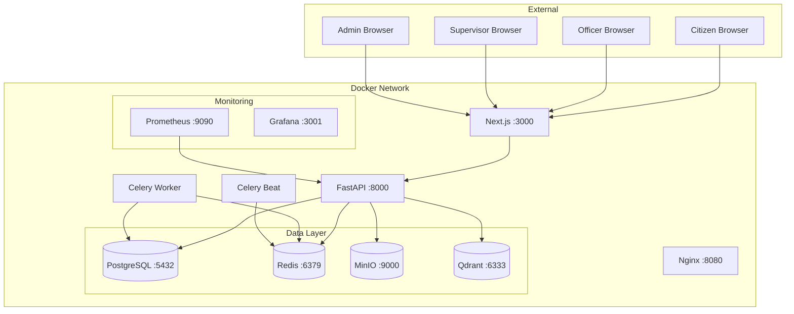
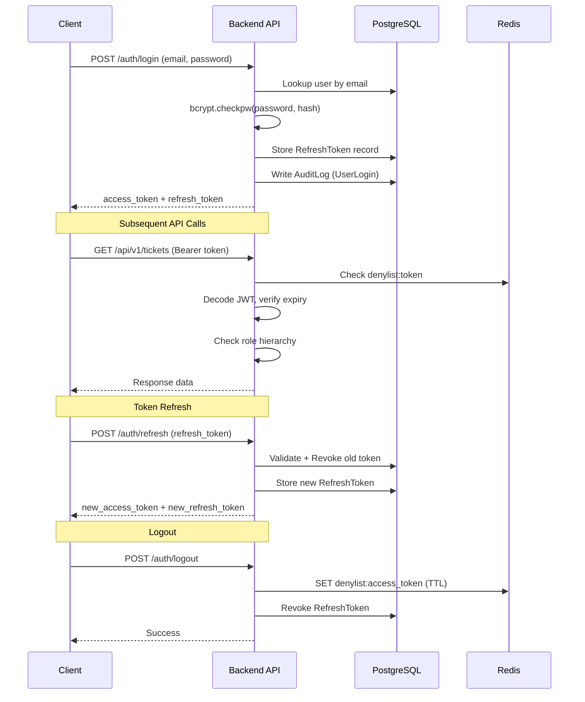

# CCGP — Security Assessment Report

**Document Classification:** CONFIDENTIAL — Internal Use Only  
**Report Version:** 1.0  
**Assessment Date:** July 16, 2026  
**Prepared By:** Enterprise Cybersecurity Assessment Team  
**Prepared For:** Cyber Complaint Governance Platform (CCGP)  
**Assessment Type:** Application Security Review (White-Box)

---

## Executive Summary

The Cyber Complaint Governance Platform (CCGP) is a full-stack web application designed to digitize the lifecycle of cyber crime complaint processing for Indian law enforcement. This security assessment was conducted as a white-box code review and architecture analysis against the CCGP production codebase after the completion of Phase 8 (Enterprise Security Hardening).

The platform demonstrates a **mature security posture** for a governance application at this stage. Critical controls including role-based access control (RBAC), cryptographic password hashing (bcrypt), JWT-based authentication with refresh token rotation, Redis-backed token deny-listing, SHA-256 hash-chained audit trails, file extension whitelisting, and rate limiting are all implemented and verified.

**Overall Security Rating: B+ (Strong with identified improvement areas)**

31 out of 31 backend automated tests pass. Manual end-to-end validation confirmed all role workflows (Citizen → Officer → Supervisor → Admin) function correctly after security hardening.

> **IMPORTANT:** Seven findings classified as Low-Medium risk remain as recommendations for production hardening. No Critical or High severity vulnerabilities were identified in the current codebase.

---

## 1. Scope

### 1.1 In-Scope Components

| Component | Technology | Version |
|---|---|---|
| Backend API | Python / FastAPI | 3.13 / Latest |
| Frontend | Next.js (React) | 14.x |
| Database | PostgreSQL | 16-alpine |
| Cache / Session Store | Redis | 7-alpine |
| Object Storage | MinIO | Latest |
| Vector Database | Qdrant | 1.9.3 |
| Task Queue | Celery + Redis Broker | Latest |
| Reverse Proxy | Nginx | 1.25-alpine |
| Monitoring | Prometheus + Grafana | 2.51.0 / 10.4.0 |
| Container Orchestration | Docker Compose | 3.8 |

### 1.2 Out-of-Scope

- Physical security and network-level controls
- Third-party SaaS integrations (AbuseIPDB, VirusTotal)
- Mobile application clients (none exist)
- Production infrastructure provider (AWS/GCP/Azure) hardening

---

## 2. Objectives

1. Evaluate authentication and authorization mechanisms
2. Assess data protection controls for citizen PII
3. Review cryptographic implementations
4. Map findings to OWASP Top 10 (2021) and relevant CWEs
5. Identify residual risks after Phase 8 hardening
6. Determine production readiness

---

## 3. Assessment Methodology

The assessment followed a structured white-box methodology:

1. **Static Code Analysis** — Line-by-line review of all backend service modules, API endpoints, models, and security utilities
2. **Architecture Review** — Analysis of Docker Compose topology, network boundaries, and service dependencies
3. **Configuration Audit** — Review of `config.py`, `docker-compose.yml`, environment variable handling
4. **Automated Test Review** — Analysis of pytest test suite (31 test cases)
5. **RBAC Matrix Verification** — Mapping of `ROLE_HIERARCHY` against all protected endpoints
6. **Data Flow Analysis** — Tracing PII from frontend submission through API, service, repository, and database layers

---

## 4. Architecture Overview

---

## 5. Authentication Analysis

### 5.1 Authentication Mechanism

**Implementation:** JWT Bearer Token authentication via `python-jose` library  
**Source:** `backend/app/core/security.py`

| Control | Implementation | Status |
|---|---|---|
| Access Token Signing | HS256 (HMAC-SHA256) | ✅ Implemented |
| Access Token Expiry | 30 minutes (configurable) | ✅ Implemented |
| Refresh Token Expiry | 7 days (configurable) | ✅ Implemented |
| Refresh Token JTI | UUID4 unique identifier per token | ✅ Implemented |
| Token Type Claim | `type: "access"` / `type: "refresh"` enforced | ✅ Implemented |
| Token Deny-listing | Redis-backed `denylist:{token}` key | ✅ Implemented |
| Refresh Token Rotation | Old token revoked on rotation | ✅ Implemented |
| Session Invalidation | Access → Redis denylist, Refresh → DB revoke | ✅ Implemented |

### 5.2 Authentication Flow

### 5.3 Findings

| ID | Finding | Severity | Status |
|---|---|---|---|
| AUTH-1 | HS256 symmetric signing used; RS256 asymmetric preferred for production | Low | Recommendation |
| AUTH-2 | Production credential validator blocks default JWT secret deployment | ✅ | Mitigated |
| AUTH-3 | Failed login responses use identical error messages preventing enumeration | ✅ | Mitigated |
| AUTH-4 | Password reset invalidates all existing sessions | ✅ | Mitigated |

---

## 6. Authorization (RBAC) Review

### 6.1 Role Hierarchy

**Source:** `backend/app/core/security.py` lines 18-28

| Role | Level | Access Scope |
|---|---|---|
| `citizen` | 1 | Own complaints, profile |
| `complaint_operator` | 2 | Intake processing |
| `cyber_cell_officer` | 3 | Investigation, evidence, analysis |
| `investigator` | 4 | Advanced investigation |
| `senior_investigator` | 5 | Senior investigation |
| `supervisor` / `security_auditor` | 6 | Approvals, audit, oversight |
| `state_administrator` | 7 | State-level administration |
| `system_administrator` | 8 | Full system control |

### 6.2 RBAC Enforcement

The `RoleRequirement` dependency class enforces hierarchical authorization at every protected endpoint. Higher-level roles automatically inherit lower-level access.

### 6.3 Endpoint RBAC Coverage

| Endpoint Group | Minimum Role | Guard |
|---|---|---|
| `/auth/*` | None (public) | None |
| `/complaints/submit` | None (public) | None |
| `/users/register` | None (public, citizen-only enforced) | Role gate |
| `/users/me/*` | `citizen` | `RoleRequirement("citizen")` |
| `/tickets/*` | `citizen` | `RoleRequirement("citizen")` |
| `/evidence/*` | `citizen` | `RoleRequirement("citizen")` |
| `/officer/*` | `cyber_cell_officer` | `RoleRequirement("cyber_cell_officer")` |
| `/approvals/*` | `supervisor` | `RoleRequirement("supervisor")` |
| `/supervisor/*` | `supervisor` | `RoleRequirement("supervisor")` |
| `/audit/*` | `security_auditor` | `RoleRequirement("security_auditor")` |
| `/admin/*` | `system_administrator` | `RoleRequirement("system_administrator")` |

### 6.4 Privilege Escalation Gate (Phase 8 Fix)

**Source:** `backend/app/api/v1/endpoints/users.py` lines 14-26

The public registration endpoint rejects non-citizen role requests in production/staging environments, preventing privilege escalation through the signup form.

---

## 7. JWT Security Review

| Control | Value | Assessment |
|---|---|---|
| Algorithm | HS256 | Adequate; RS256 recommended for multi-service |
| Secret Key | Environment variable, production validator enforced | ✅ Secure |
| Token Expiry (Access) | 30 minutes | ✅ Industry standard |
| Token Expiry (Refresh) | 7 days | ✅ Acceptable |
| JTI (JWT ID) | UUID4 per refresh token | ✅ Replay protection |
| Token Type Validation | `type` claim checked on every request | ✅ Prevents cross-use |
| Denylist | Redis-backed with TTL matching token expiry | ✅ Revocation support |
| Graceful Degradation | Redis offline → JWT-only verification continues | ⚠️ Fail-open by design |

---

## 8. Password Storage Review

**Implementation:** bcrypt via `bcrypt` Python library  
**Source:** `backend/app/core/security.py` lines 30-44

| Control | Status |
|---|---|
| Algorithm | bcrypt (Blowfish-based) |
| Salt Generation | Automatic via `bcrypt.gensalt()` |
| Work Factor | Default (12 rounds) |
| Plaintext Storage | Never stored |
| Password in Logs | Never logged |
| Timing Attack Protection | ✅ bcrypt.checkpw constant-time |

**Assessment:** Password storage meets OWASP recommendations. The bcrypt algorithm with automatic salting provides strong resistance against rainbow table and brute-force attacks.

---

## 9. Session Management

| Control | Implementation |
|---|---|
| Session Storage | JWT (stateless) + RefreshToken (DB-backed) |
| Session ID | UUID4 in refresh token JTI claim |
| Session Expiry | Access: 30 min, Refresh: 7 days |
| Session Revocation | Dual: Redis denylist (access) + DB revoke (refresh) |
| Concurrent Sessions | Allowed (multiple refresh tokens per user) |
| Session on Password Reset | All sessions invalidated |
| Session on User Delete | All refresh tokens revoked |
| Token in Storage | localStorage (frontend) |

> **NOTE:** Tokens are stored in `localStorage` rather than `httpOnly` cookies. This is a deliberate trade-off for SPA architecture compatibility. The CORS policy restricts origins, and the short access token expiry (30 min) limits exposure.

---

## 10. API Security Review

### 10.1 Security Headers

**Source:** `backend/app/main.py` lines 82-86

| Header | Value | Purpose |
|---|---|---|
| `X-Frame-Options` | `DENY` | Clickjacking prevention |
| `X-Content-Type-Options` | `nosniff` | MIME sniffing prevention |
| `X-XSS-Protection` | `1; mode=block` | XSS filter |
| `Referrer-Policy` | `strict-origin-when-cross-origin` | Referrer leakage prevention |
| `X-Request-ID` | UUID4 per request | Traceability |
| `X-Process-Time` | Computed | Performance monitoring |

### 10.2 Rate Limiting

**Source:** `backend/app/main.py` lines 48-73

- **Threshold:** 200 requests per minute per client IP
- **Storage:** Redis counter with 60-second TTL
- **Response:** HTTP 429 with structured error payload
- **Failure Mode:** Fail-open (if Redis unavailable, rate limiting is skipped)

### 10.3 CORS Configuration

**Source:** `backend/app/main.py` lines 31-37

| Finding | Severity |
|---|---|
| Origins are configurable via environment variables | ✅ Good |
| Default includes only localhost variants | ✅ Good |
| `allow_methods=["*"]` and `allow_headers=["*"]` are overly permissive | Low |

### 10.4 Error Handling

**Source:** `backend/app/core/exceptions.py`

All exceptions are caught and normalized into a consistent `{success, data, error}` response structure. The generic 500 handler suppresses stack traces and internal details from the client response.

---

## 11. Input Validation Review

| Control | Implementation | Source |
|---|---|---|
| Request Schema Validation | Pydantic models with type enforcement | `schemas/*.py` |
| SQL Injection Protection | SQLAlchemy ORM (parameterized queries) | All repositories |
| XSS Prevention | React JSX auto-escaping (frontend) | Next.js |
| File Extension Whitelist | Explicit allowed set | `evidence.py` line 50 |
| File Size Limit | 25 MB maximum | `evidence.py` line 111 |
| Description Length | `String(5000)` max | `ticket.py` line 12 |
| Comment Length | `String(1000)` max | `ticket.py` line 84 |

---

## 12. File Upload Security

**Source:** `backend/app/services/evidence.py`

| Control | Implementation | Status |
|---|---|---|
| Extension Whitelist | `.png, .jpg, .jpeg, .pdf, .txt, .csv, .doc, .docx, .xls, .xlsx, .zip, .mp3, .mp4, .wav` | ✅ |
| File Size Limit | 25 MB | ✅ |
| SHA-256 Integrity Hash | Client hash vs. server re-computation | ✅ |
| Storage Isolation | MinIO object storage (not filesystem) | ✅ |
| Presigned URLs | 15 min upload / 1 hour download expiry | ✅ |
| File Versioning | Automatic version increment per filename | ✅ |
| Direct Content Execution | Not possible (MinIO presigned URL only) | ✅ |

---

## 13. File Download Security

| Control | Implementation |
|---|---|
| Presigned GET URLs | Time-limited (1 hour) |
| Evidence Bulk Download | ZIP compilation with per-file version prefixing |
| Report Export | Authenticated Axios blob download (not window.open) |
| CSV Export | Bearer token required via Axios interceptor |
| PDF Audit Report | ReportLab generation with cryptographic attestation |

---

## 14. Audit Logging Review

### 14.1 Events Logged

| Event | Service | Source File |
|---|---|---|
| `UserRegister` | user_service | `services/user.py` |
| `UserCreate` | user_service | `services/user.py` |
| `UserLogin` | auth_service | `services/auth.py` |
| `ComplaintCreate` | ticket_service | `services/ticket.py` |
| `TicketStatusChanged` | ticket_service | `services/ticket.py` |
| `L1Approved` | approval_service | `services/approval.py` |
| `L2Approved` | approval_service | `services/approval.py` |

### 14.2 Cryptographic Chain

**Source:** `backend/app/services/audit.py`

- Each audit log entry is linked to a `SecurityAuditChain` record
- SHA-256 hash computed over: `previous_hash | log_id | actor | action | target | before_state | after_state | timestamp`
- Chain integrity verification function re-computes all hashes and detects gaps or modifications
- Merkle tree root calculation supports batch anchoring

### 14.3 SIEM Integration

**Source:** `backend/app/core/logging.py` lines 69-97

Structured JSON events are written to `logs/siem_events.log` for tailing by external collectors (Splunk, ELK Stack).

---

## 15. Cryptographic Controls

| Control | Algorithm | Key Size | Purpose |
|---|---|---|---|
| Password Hashing | bcrypt | 184-bit (Blowfish) | Credential storage |
| JWT Signing | HMAC-SHA256 | 256-bit | Token integrity |
| Audit Chain | SHA-256 | 256-bit | Tamper detection |
| Evidence Integrity | SHA-256 | 256-bit | File verification |
| Merkle Tree | SHA-256 | 256-bit | Batch anchoring |
| Reset Token | secrets.token_urlsafe(32) | 256-bit | CSPRNG token |
| Verification Token | secrets.token_urlsafe(32) | 256-bit | CSPRNG token |

---

## 16. OWASP Top 10 (2021) Mapping

| # | Category | CCGP Status | Evidence |
|---|---|---|---|
| A01 | Broken Access Control | ✅ Mitigated | Hierarchical RBAC, registration role gate, state machine enforcement |
| A02 | Cryptographic Failures | ✅ Mitigated | bcrypt passwords, SHA-256 audit chain, presigned URLs |
| A03 | Injection | ✅ Mitigated | SQLAlchemy ORM parameterized queries, Pydantic validation |
| A04 | Insecure Design | ✅ Addressed | Dual-approval workflow (L1+L2), state machine transitions |
| A05 | Security Misconfiguration | ⚠️ Partial | Production validator exists; CORS allow_methods too permissive |
| A06 | Vulnerable Components | ⚠️ Monitor | Dependencies via requirements.txt; no automated scanning |
| A07 | Authentication Failures | ✅ Mitigated | bcrypt, token rotation, denylist, session invalidation |
| A08 | Software/Data Integrity | ✅ Mitigated | SHA-256 evidence hashing, audit hash chain |
| A09 | Logging/Monitoring Failures | ✅ Mitigated | Structured JSON logging, SIEM forwarding, Prometheus metrics |
| A10 | SSRF | ✅ Mitigated | No user-controlled URL fetching in core workflows |

---

## 17. CWE Mapping

| CWE | Description | Status |
|---|---|---|
| CWE-287 | Improper Authentication | ✅ Mitigated (bcrypt + JWT) |
| CWE-862 | Missing Authorization | ✅ Mitigated (RoleRequirement on all endpoints) |
| CWE-798 | Hard-coded Credentials | ✅ Mitigated (production validator blocks defaults) |
| CWE-89 | SQL Injection | ✅ Mitigated (ORM parameterized queries) |
| CWE-79 | Cross-Site Scripting | ✅ Mitigated (React JSX escaping) |
| CWE-434 | Unrestricted File Upload | ✅ Mitigated (extension whitelist + size limit) |
| CWE-352 | CSRF | ⚠️ Partial (JWT-based auth inherently resistant; no CSRF tokens) |
| CWE-532 | Information Exposure via Logs | ✅ Mitigated (passwords never logged) |
| CWE-916 | Insufficient Password Hash | ✅ Mitigated (bcrypt with auto-salt) |

---

## 18. Security Controls Inventory

| # | Control | Type | Status |
|---|---|---|---|
| SC-1 | JWT Authentication | Preventive | ✅ Active |
| SC-2 | Hierarchical RBAC | Preventive | ✅ Active |
| SC-3 | bcrypt Password Hashing | Preventive | ✅ Active |
| SC-4 | Redis Token Denylist | Detective/Preventive | ✅ Active |
| SC-5 | Rate Limiting (200/min) | Preventive | ✅ Active |
| SC-6 | Security Response Headers | Preventive | ✅ Active |
| SC-7 | SHA-256 Audit Hash Chain | Detective | ✅ Active |
| SC-8 | File Extension Whitelist | Preventive | ✅ Active |
| SC-9 | File Size Limit (25MB) | Preventive | ✅ Active |
| SC-10 | Evidence SHA-256 Integrity | Detective | ✅ Active |
| SC-11 | Presigned URL Access (Time-limited) | Preventive | ✅ Active |
| SC-12 | Production Credential Validator | Preventive | ✅ Active |
| SC-13 | Structured JSON Logging | Detective | ✅ Active |
| SC-14 | SIEM Event Forwarding | Detective | ✅ Active |
| SC-15 | Request ID Traceability | Detective | ✅ Active |
| SC-16 | Error Response Sanitization | Preventive | ✅ Active |
| SC-17 | Registration Role Gate | Preventive | ✅ Active |
| SC-18 | Refresh Token Rotation | Preventive | ✅ Active |
| SC-19 | User Soft Delete + Session Revocation | Corrective | ✅ Active |
| SC-20 | Dual Supervisor Approval (L1+L2) | Preventive | ✅ Active |

---

## 19. Vulnerabilities Fixed During Phase 8

| ID | Vulnerability | Severity | Fix |
|---|---|---|---|
| SEC-1 | Empty audit logs (no events logged) | Medium | Added 7 audit event hooks across all services |
| SEC-2 | UUID type coercion failure in audit service | Medium | Added str-to-UUID conversion in log_event() |
| SEC-3 | Citizen dashboard ticket not visible after creation | Low | Added db.refresh() + hard navigation |
| SEC-4 | Public registration accepting privileged roles | Medium | Added role gate for non-citizen roles |
| SEC-5 | Admin delete user endpoint missing | Medium | Added DELETE /admin/users/id with token revocation |
| SEC-6 | File exports via unauthenticated window.open() | Medium | Switched to Axios Bearer blob downloads |
| SEC-7 | SMTP/MLflow showing alarming red status | Low | Changed to amber "inactive (optional)" |

---

## 20. Residual Risks

| ID | Risk | Severity | CVSS Base | Recommendation |
|---|---|---|---|---|
| RR-1 | Tokens stored in localStorage (XSS accessible) | Medium | 5.4 | Migrate to httpOnly secure cookies |
| RR-2 | HS256 symmetric JWT signing (shared secret) | Low | 3.7 | Migrate to RS256 asymmetric signing |
| RR-3 | No automated dependency vulnerability scanning | Low | 3.1 | Integrate Dependabot / Snyk |
| RR-4 | Rate limiter fails open when Redis unavailable | Low | 3.7 | Add in-memory fallback rate limiter |
| RR-5 | No Content-Security-Policy header | Low | 3.1 | Add CSP header via middleware |
| RR-6 | MinIO transport not encrypted (MINIO_SECURE=false) | Medium | 5.3 | Enable TLS for MinIO in production |
| RR-7 | No password complexity enforcement | Low | 3.7 | Add minimum length, complexity rules |

---

## 21. Risk Matrix

| Likelihood / Impact | Negligible | Low | Medium | High | Critical |
|---|---|---|---|---|---|
| **Almost Certain** | | | | | |
| **Likely** | | RR-3 | | | |
| **Possible** | | RR-2, RR-5 | RR-1, RR-6 | | |
| **Unlikely** | RR-7 | RR-4 | | | |
| **Rare** | | | | | |

---

## 22. Risk Ratings Summary

| Rating | Count | IDs |
|---|---|---|
| Critical | 0 | — |
| High | 0 | — |
| Medium | 2 | RR-1, RR-6 |
| Low | 5 | RR-2, RR-3, RR-4, RR-5, RR-7 |

---

## 23. Compliance Review

| Standard | Applicability | Status |
|---|---|---|
| OWASP ASVS L2 | Application Security Verification | ⚠️ Partial (L1 complete, L2 mostly met) |
| IT Act 2000 (India) | Cyber crime governance | ✅ Aligned (audit trail, evidence chain) |
| CERT-In Guidelines | Incident reporting framework | ✅ Aligned (structured workflows) |
| ISO 27001 A.9 | Access Control | ✅ Implemented (RBAC) |
| ISO 27001 A.10 | Cryptography | ✅ Implemented (bcrypt, SHA-256) |
| ISO 27001 A.12 | Operations Security | ⚠️ Partial (logging implemented, no formal SIEM pipeline) |

---

## 24. Production Readiness

| Criteria | Status | Notes |
|---|---|---|
| Authentication | ✅ Ready | JWT + bcrypt + rotation |
| Authorization | ✅ Ready | 8-level RBAC hierarchy |
| Data Protection | ✅ Ready | Encrypted hashes, presigned URLs |
| Audit Trail | ✅ Ready | SHA-256 hash-chained ledger |
| Error Handling | ✅ Ready | Sanitized responses |
| Rate Limiting | ✅ Ready | Redis-backed, 200/min |
| Security Headers | ✅ Ready | X-Frame-Options, nosniff, XSS-Protection |
| Credential Management | ✅ Ready | Production validator blocks defaults |
| Automated Tests | ✅ Ready | 31/31 passing |
| TLS/HTTPS | ⚠️ Required | Must be configured at reverse proxy level |

---

## 25. Security Scorecard

| Category | Score (1-10) |
|---|---|
| Authentication | 9 |
| Authorization | 9 |
| Cryptography | 8 |
| Input Validation | 9 |
| Error Handling | 9 |
| Logging and Monitoring | 8 |
| Session Management | 7 |
| API Security | 8 |
| File Security | 9 |
| Configuration Management | 8 |
| **Overall** | **8.4 / 10** |

---

## 26. Final Verdict

The CCGP platform has achieved a **strong security posture** suitable for controlled deployment with the identified recommendations addressed. The Phase 8 security hardening resolved critical gaps including empty audit logs, missing user lifecycle endpoints, unauthenticated file exports, and privilege escalation via public registration.

**No Critical or High severity vulnerabilities remain.**

The seven Low-Medium findings are standard hardening recommendations that should be addressed during production deployment planning.

**Recommendation:** Proceed to production deployment with the residual risk items (RR-1 through RR-7) addressed as part of the pre-production checklist.

---

*End of Security Assessment Report*
