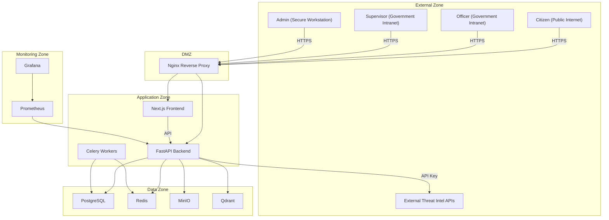
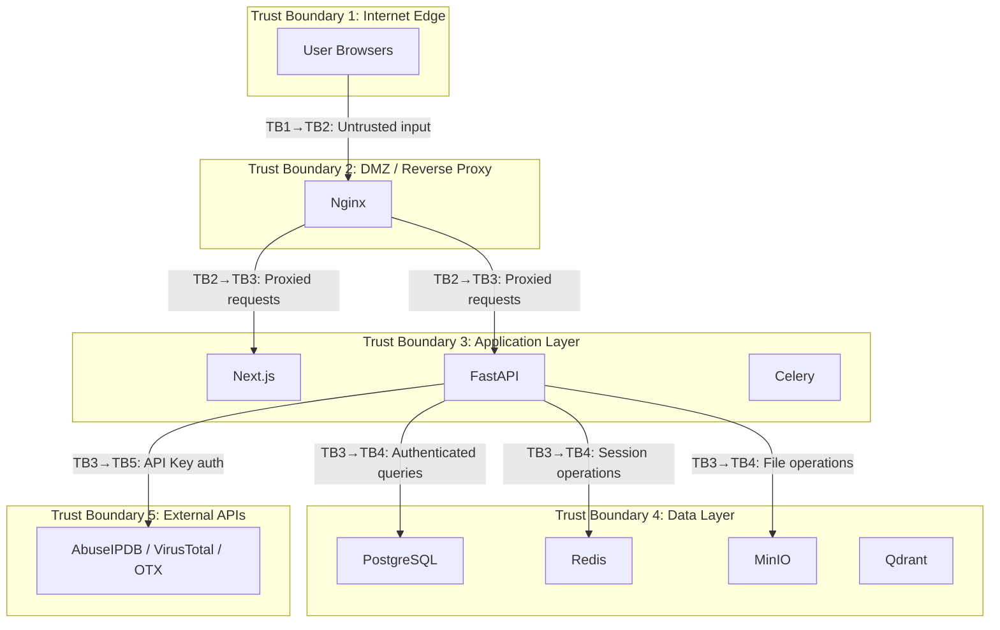
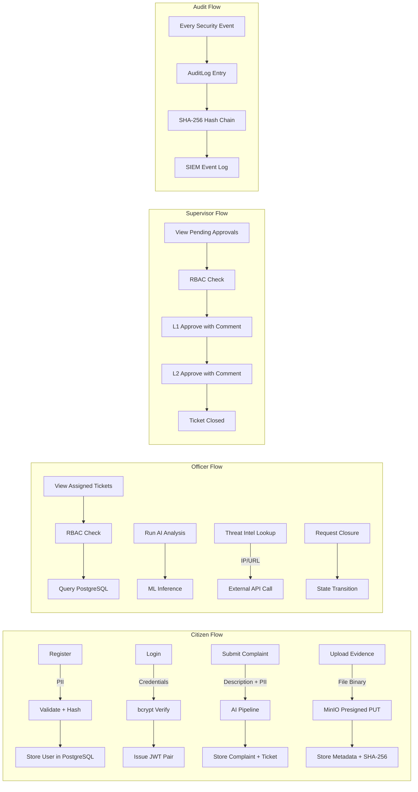
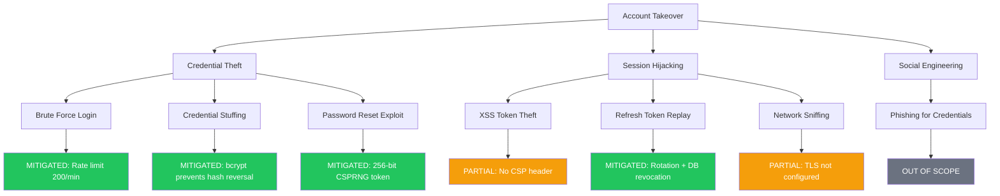
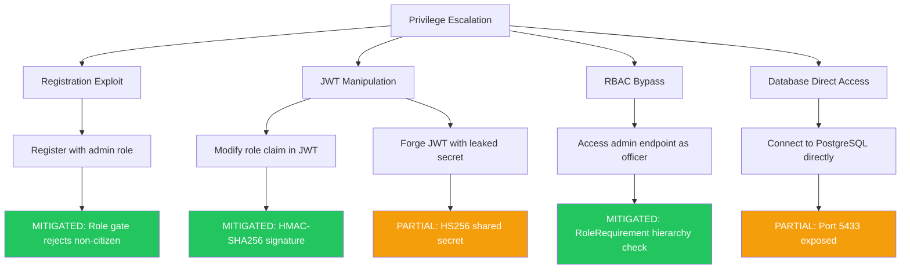

# CCGP — Threat Model Report

**Document Classification:** CONFIDENTIAL — Internal Use Only  
**Report Version:** 1.0  
**Assessment Date:** July 16, 2026  
**Prepared By:** Enterprise Threat Modeling and Red Team Analysis Division  
**Prepared For:** Cyber Complaint Governance Platform (CCGP)  
**Methodology:** STRIDE Threat Modeling Framework  
**Reference Standards:** MITRE ATT&CK v14, OWASP Threat Modeling, NIST SP 800-154

---

## Executive Summary

This threat model report applies the STRIDE methodology to the Cyber Complaint Governance Platform (CCGP) — an 11-container Docker-orchestrated system that processes cyber crime complaints, evidence, and investigation workflows for Indian law enforcement.

The analysis identifies threat actors, maps attack surfaces, evaluates trust boundaries, and assesses 42 threat scenarios across six STRIDE categories. Each threat is mapped to MITRE ATT&CK techniques and assigned a CVSS v3.1 base score.

**Key Findings:**

- **28 threats** are fully mitigated by existing controls
- **10 threats** are partially mitigated with residual risk
- **4 threats** require additional controls for production deployment
- No **Critical** unmitigated threats were identified
- The most significant residual risks relate to TLS configuration, token storage, and dependency scanning

**Overall Threat Level: MODERATE (controlled risk, suitable for deployment with recommendations)**

---

## 1. Scope

### 1.1 Systems Assessed

| System | Components |
|---|---|
| Frontend | Next.js 14, Axios HTTP client, localStorage token storage |
| Backend | FastAPI, Pydantic, SQLAlchemy, python-jose, bcrypt |
| Data Stores | PostgreSQL 16, Redis 7, MinIO, Qdrant |
| Infrastructure | Docker Compose, Nginx, Celery, Prometheus, Grafana |
| AI/ML | Sentence-transformers, NER pipeline, Qdrant vector search |
| External APIs | AbuseIPDB, VirusTotal, AlienVault OTX |

### 1.2 Exclusions

- Physical infrastructure security
- Mobile application clients (none exist)
- Cloud provider-level controls (AWS/GCP/Azure)
- Social engineering and phishing attacks against personnel

---

## 2. Objectives

1. Identify all assets requiring protection
2. Map trust boundaries across the Docker architecture
3. Enumerate external and internal attack surfaces
4. Perform STRIDE analysis on all data flows
5. Map identified threats to MITRE ATT&CK techniques
6. Assess existing mitigations and residual risk
7. Recommend controls for unmitigated threats

---

## 3. Methodology

The assessment follows the Microsoft STRIDE threat modeling process:

| Phase | Activity |
|---|---|
| **1. Decompose** | Identify assets, trust boundaries, entry points, data flows |
| **2. Enumerate** | Apply STRIDE categories to every data flow crossing a trust boundary |
| **3. Assess** | Evaluate likelihood and impact using CVSS v3.1 scoring |
| **4. Mitigate** | Map existing controls and identify gaps |
| **5. Validate** | Cross-reference findings with MITRE ATT&CK and OWASP |

### STRIDE Categories

| Category | Description |
|---|---|
| **S** — Spoofing | Pretending to be another user or system |
| **T** — Tampering | Unauthorized modification of data |
| **R** — Repudiation | Denying an action occurred |
| **I** — Information Disclosure | Unauthorized data exposure |
| **D** — Denial of Service | Making the system unavailable |
| **E** — Elevation of Privilege | Gaining unauthorized access levels |

---

## 4. System Overview

The CCGP processes sensitive government law enforcement data through a multi-tier architecture:

---

## 5. Assets Inventory

### 5.1 Data Assets

| Asset | Classification | Value | Custodian |
|---|---|---|---|
| Citizen PII (name, email, phone) | Confidential | High | PostgreSQL |
| User credentials (bcrypt hashes) | Restricted | Critical | PostgreSQL |
| JWT signing secret | Restricted | Critical | Environment variable |
| Complaint descriptions | Confidential | High | PostgreSQL |
| Evidence files (documents, images) | Confidential | High | MinIO |
| Investigation notes | Confidential | High | PostgreSQL |
| Audit log chain | Internal | High | PostgreSQL |
| AI classification results | Internal | Medium | PostgreSQL + Qdrant |
| Threat intelligence data | Internal | Medium | PostgreSQL |
| System configuration | Internal | Medium | PostgreSQL |
| Session tokens (access + refresh) | Restricted | High | Redis + PostgreSQL |

### 5.2 System Assets

| Asset | Importance | Justification |
|---|---|---|
| FastAPI Backend | Critical | All business logic, authentication, authorization |
| PostgreSQL Database | Critical | All persistent structured data |
| MinIO Object Storage | High | Evidence file storage |
| Redis Cache | High | Session denylist, rate limiting, message broker |
| Nginx Reverse Proxy | High | Entry point, TLS termination |
| Celery Workers | Medium | Async email notifications, scheduled tasks |
| Prometheus + Grafana | Medium | Observability and alerting |

---

## 6. Trust Boundaries

| Boundary | From | To | Data Crossing | Controls |
|---|---|---|---|---|
| TB1→TB2 | Internet | Nginx | HTTP requests | TLS termination (when configured) |
| TB2→TB3 | Nginx | Backend | Proxied HTTP | CORS, rate limiting |
| TB3→TB3 | Frontend | Backend | API calls | JWT Bearer authentication |
| TB3→TB4 | Backend | PostgreSQL | SQL queries | Parameterized queries (ORM) |
| TB3→TB4 | Backend | Redis | Session ops | Docker network isolation |
| TB3→TB4 | Backend | MinIO | Presigned URLs | Access key authentication |
| TB3→TB5 | Backend | External APIs | IP/hash lookups | API key authentication |

---

## 7. Data Flow Diagram

---

## 8. External Attack Surface

| Entry Point | Protocol | Authentication | Rate Limited | Input Validation |
|---|---|---|---|---|
| `POST /api/v1/auth/login` | HTTP | None (credentials in body) | ✅ 200/min | ✅ Pydantic |
| `POST /api/v1/auth/register` | HTTP | None (public) | ✅ 200/min | ✅ Pydantic + role gate |
| `POST /api/v1/complaints/submit` | HTTP | None (public) | ✅ 200/min | ✅ Pydantic |
| `POST /api/v1/auth/refresh` | HTTP | Refresh token | ✅ 200/min | ✅ JWT decode |
| `POST /api/v1/auth/forgot-password` | HTTP | None (email) | ✅ 200/min | ✅ Pydantic |
| `GET /api/v1/health` | HTTP | None | Exempt | N/A |
| MinIO Console (`:9001`) | HTTP | Admin credentials | ❌ | N/A |
| Grafana Dashboard (`:3001`) | HTTP | Admin credentials | ❌ | N/A |
| Prometheus (`:9090`) | HTTP | None | ❌ | N/A |

## 9. Internal Attack Surface

| Surface | Risk | Current Mitigation |
|---|---|---|
| Docker container escape | Medium | Alpine-based minimal images |
| Inter-container network sniffing | Low | Docker bridge network isolation |
| Database direct access via exposed port | Medium | Port 5433 mapped to host |
| Redis unauthenticated access | Medium | No Redis AUTH password configured |
| MinIO admin console exposure | Medium | Credentials in environment variables |
| Prometheus metrics exposure | Low | Port 9090 accessible without auth |

---

## 10. Authentication Threat Analysis

| ID | Threat | STRIDE | CVSS | Mitigation | Status |
|---|---|---|---|---|---|
| AUTH-T1 | Brute force login attempts | S | 5.3 | Rate limiting (200/min per IP) | ✅ Mitigated |
| AUTH-T2 | Credential stuffing with leaked databases | S | 6.5 | bcrypt hashing prevents reverse lookup | ✅ Mitigated |
| AUTH-T3 | JWT token theft via XSS | S | 5.4 | Tokens in localStorage; no CSP header | ⚠️ Partial |
| AUTH-T4 | Stolen refresh token replay | S | 4.3 | Rotation on use; DB-backed revocation | ✅ Mitigated |
| AUTH-T5 | JWT signing key compromise | S | 9.1 | Environment variable; production validator | ⚠️ Partial |
| AUTH-T6 | User enumeration via error messages | I | 3.7 | Identical error for invalid email/password | ✅ Mitigated |
| AUTH-T7 | Session fixation | S | 3.1 | New token pair on every login | ✅ Mitigated |
| AUTH-T8 | Password reset token brute force | S | 3.7 | `secrets.token_urlsafe(32)` — 256-bit entropy | ✅ Mitigated |

---

## 11. Authorization Threat Analysis

| ID | Threat | STRIDE | CVSS | Mitigation | Status |
|---|---|---|---|---|---|
| AUTHZ-T1 | Citizen accessing officer endpoints | E | 7.5 | `RoleRequirement("cyber_cell_officer")` on all officer routes | ✅ Mitigated |
| AUTHZ-T2 | Officer accessing admin endpoints | E | 8.1 | `RoleRequirement("system_administrator")` on admin routes | ✅ Mitigated |
| AUTHZ-T3 | Self-registration with admin role | E | 9.8 | Public registration role gate (citizen-only enforcement) | ✅ Mitigated (Phase 8) |
| AUTHZ-T4 | Horizontal privilege escalation (access other user data) | E | 6.5 | Citizen queries filtered by `citizen_id`; officer queries filtered by `assigned_officer_id` | ✅ Mitigated |
| AUTHZ-T5 | Bypassing dual approval via direct API | E | 7.5 | State machine enforces L1+L2 before "Closed" transition | ✅ Mitigated |
| AUTHZ-T6 | Role manipulation in JWT payload | T, E | 7.5 | JWT signed with HMAC-SHA256; tampering invalidates signature | ✅ Mitigated |

---

## 12. Session Management Threats

| ID | Threat | STRIDE | CVSS | Mitigation | Status |
|---|---|---|---|---|---|
| SESS-T1 | Stale sessions after password change | S | 5.3 | All refresh tokens revoked on password reset | ✅ Mitigated |
| SESS-T2 | Stale sessions after user deletion | S | 5.3 | All refresh tokens revoked + `is_active=False` | ✅ Mitigated (Phase 8) |
| SESS-T3 | Access token use after logout | S | 3.7 | Redis denylist with TTL matching token expiry | ✅ Mitigated |
| SESS-T4 | Redis denylist bypass when Redis offline | S | 4.3 | Fail-open design — JWT still validated cryptographically | ⚠️ Partial |
| SESS-T5 | Concurrent session abuse | S | 3.1 | Multiple sessions allowed by design | ⚠️ Accepted risk |

---

## 13. API Threats

| ID | Threat | STRIDE | CVSS | Mitigation | Status |
|---|---|---|---|---|---|
| API-T1 | SQL injection via query parameters | T | 8.6 | SQLAlchemy ORM parameterized queries | ✅ Mitigated |
| API-T2 | Cross-site scripting via complaint text | T | 6.1 | React JSX auto-escaping; no `dangerouslySetInnerHTML` | ✅ Mitigated |
| API-T3 | CORS bypass from unauthorized origins | S | 5.3 | Explicit origin whitelist in `BACKEND_CORS_ORIGINS` | ✅ Mitigated |
| API-T4 | Rate limit bypass via IP spoofing | D | 5.3 | X-Forwarded-For not checked; `request.client.host` used | ⚠️ Partial |
| API-T5 | Clickjacking via iframe embedding | T | 4.3 | `X-Frame-Options: DENY` header | ✅ Mitigated |
| API-T6 | Sensitive data in error responses | I | 4.3 | Generic 500 error handler with empty details | ✅ Mitigated |
| API-T7 | OpenAPI/Swagger exposure in production | I | 3.1 | `/docs` and `/redoc` enabled; should disable in production | ⚠️ Partial |
| API-T8 | Mass assignment via unvalidated fields | T | 5.3 | Pydantic schemas enforce exact field sets | ✅ Mitigated |

---

## 14. Database Threats

| ID | Threat | STRIDE | CVSS | Mitigation | Status |
|---|---|---|---|---|---|
| DB-T1 | Direct database access from host network | I | 6.5 | Port 5433 exposed to host; Docker network isolation | ⚠️ Partial |
| DB-T2 | Default database credentials in production | S | 9.1 | `validate_production_credentials()` blocks defaults | ✅ Mitigated |
| DB-T3 | Unencrypted database connections | I | 5.3 | Docker bridge network (no sslmode configured) | ⚠️ Partial |
| DB-T4 | Data exfiltration via SQL injection | I | 8.6 | SQLAlchemy ORM prevents raw SQL | ✅ Mitigated |
| DB-T5 | Unauthorized schema modification | T | 7.5 | Application uses ORM; no raw DDL exposure | ✅ Mitigated |

---

## 15. File Upload Threats

| ID | Threat | STRIDE | CVSS | Mitigation | Status |
|---|---|---|---|---|---|
| FILE-T1 | Malicious file upload (web shell) | E | 8.8 | Extension whitelist; MinIO storage (no execution context) | ✅ Mitigated |
| FILE-T2 | File size denial of service | D | 5.3 | 25 MB limit enforced server-side | ✅ Mitigated |
| FILE-T3 | Evidence tampering after upload | T | 7.5 | SHA-256 client-server hash verification | ✅ Mitigated |
| FILE-T4 | Path traversal in filename | T | 7.5 | MinIO stores by UUID-prefixed object key; no filesystem paths | ✅ Mitigated |
| FILE-T5 | MIME type spoofing | T | 4.3 | Extension validated; MIME stored but not used for execution | ⚠️ Partial |

---

## 16. File Download Threats

| ID | Threat | STRIDE | CVSS | Mitigation | Status |
|---|---|---|---|---|---|
| DL-T1 | Unauthenticated evidence download | I | 7.5 | Presigned URLs with 1-hour expiry; generation requires auth | ✅ Mitigated |
| DL-T2 | Unauthenticated CSV/PDF export | I | 6.5 | Bearer token required via Axios blob download | ✅ Mitigated (Phase 8) |
| DL-T3 | Presigned URL sharing/leakage | I | 4.3 | 1-hour expiry limits exposure window | ⚠️ Partial |

---

## 17. AI Module Threats

| ID | Threat | STRIDE | CVSS | Mitigation | Status |
|---|---|---|---|---|---|
| AI-T1 | Adversarial input to misclassify complaints | T | 4.3 | AI confidence score tracked; low-confidence flagged for review | ⚠️ Partial |
| AI-T2 | Prompt injection in complaint text | T | 3.7 | No LLM integration in classification; keyword + embedding based | ✅ Mitigated |
| AI-T3 | Model poisoning via training data | T | 5.3 | No online learning; model is read-only | ✅ Mitigated |
| AI-T4 | Data leakage via vector search results | I | 3.1 | Qdrant results filtered through RBAC | ✅ Mitigated |
| AI-T5 | Inference time side-channel | I | 2.3 | Inference time logged but not exposed to client | ✅ Mitigated |

---

## 18. Docker Infrastructure Threats

| ID | Threat | STRIDE | CVSS | Mitigation | Status |
|---|---|---|---|---|---|
| DOCKER-T1 | Container escape to host | E | 8.4 | Alpine-based minimal images reduce attack surface | ⚠️ Partial |
| DOCKER-T2 | Exposed service ports on host | I | 5.3 | PostgreSQL (5433), Redis (6379), MinIO (9000/9001) exposed | ⚠️ Partial |
| DOCKER-T3 | Secrets in docker-compose.yml | I | 7.5 | Environment variable references with defaults; `.env` file | ⚠️ Partial |
| DOCKER-T4 | Outdated base images with CVEs | E | 6.5 | No automated image scanning configured | ⚠️ Partial |
| DOCKER-T5 | Grafana default admin credentials | S | 7.2 | Default credentials configurable via env; should be changed | ⚠️ Partial |

---

## 19. Insider Threats

| ID | Threat | Actor | STRIDE | CVSS | Mitigation | Status |
|---|---|---|---|---|---|---|
| INSIDER-T1 | Officer accessing unassigned cases | Officer | E | 5.3 | Assignment-based ticket filtering | ✅ Mitigated |
| INSIDER-T2 | Admin exporting all citizen data | Admin | I | 6.5 | CSV export requires admin auth; audit logged | ⚠️ Partial |
| INSIDER-T3 | Admin creating privileged accounts | Admin | E | 5.3 | By design (admin privilege); audit logged | ⚠️ Accepted |
| INSIDER-T4 | Supervisor approving own closure request | Supervisor | R | 5.3 | No self-approval check enforced | ⚠️ Partial |
| INSIDER-T5 | DB admin deleting audit logs | DBA | R | 7.5 | SHA-256 hash chain detects deletion | ✅ Mitigated |
| INSIDER-T6 | Rogue Celery worker processing | Internal | T | 4.3 | Workers share same Docker network credentials | ⚠️ Partial |

---

## 20. Supply Chain Risks

| ID | Risk | CVSS | Current Control | Status |
|---|---|---|---|---|
| SC-T1 | Compromised PyPI package in backend | 8.1 | `requirements.txt` with pinned versions | ⚠️ No automated scanning |
| SC-T2 | Compromised npm package in frontend | 8.1 | `package-lock.json` lockfile | ⚠️ No automated scanning |
| SC-T3 | Malicious Docker base image | 7.5 | Official images (postgres, redis, nginx) | ✅ Partial |
| SC-T4 | Compromised third-party API (AbuseIPDB, VT) | 5.3 | API responses not executed; read-only data | ✅ Mitigated |

---

## 21. Abuse Cases

| # | Abuse Case | Threat Actor | Attack Vector | Impact |
|---|---|---|---|---|
| AC-1 | Mass fake complaint submission | Script kiddie | Automated POST to `/complaints/submit` | System overload, officer queue spam |
| AC-2 | Account takeover via credential stuffing | Cybercriminal | Leaked credential lists against `/auth/login` | PII theft, evidence access |
| AC-3 | Evidence manipulation in transit | Nation-state | MITM on MinIO upload | False evidence in investigations |
| AC-4 | Denial of service via large file uploads | Script kiddie | Repeated 25MB file uploads | MinIO storage exhaustion |
| AC-5 | Privilege escalation via registration | Insider | Register with admin role | Full system compromise |
| AC-6 | Audit log deletion to cover tracks | Insider (DBA) | Direct SQL DELETE on audit_logs | Destroyed accountability |

### Abuse Case Mitigations

| # | Mitigation | Effectiveness |
|---|---|---|
| AC-1 | Rate limiting (200/min per IP); CAPTCHA recommended | ⚠️ Partial |
| AC-2 | bcrypt hashing; rate limiting; account lockout recommended | ⚠️ Partial |
| AC-3 | SHA-256 integrity verification on evidence upload | ✅ Effective |
| AC-4 | 25MB file size limit enforced server-side | ✅ Effective |
| AC-5 | Public registration role gate (citizen-only) | ✅ Effective (Phase 8) |
| AC-6 | SHA-256 hash chain detects deletions/gaps | ✅ Effective |

---

## 22. Attack Trees

### 22.1 Account Takeover Attack Tree

### 22.2 Privilege Escalation Attack Tree

---

## 23. STRIDE Analysis Table

| # | Threat | S | T | R | I | D | E | CVSS | Status |
|---|---|---|---|---|---|---|---|---|---|
| 1 | Brute force login | ✓ | | | | | | 5.3 | ✅ Mitigated |
| 2 | Credential stuffing | ✓ | | | | | | 6.5 | ✅ Mitigated |
| 3 | JWT theft via XSS | ✓ | | | ✓ | | | 5.4 | ⚠️ Partial |
| 4 | Refresh token replay | ✓ | | | | | | 4.3 | ✅ Mitigated |
| 5 | JWT key compromise | ✓ | | | | | ✓ | 9.1 | ⚠️ Partial |
| 6 | User enumeration | | | | ✓ | | | 3.7 | ✅ Mitigated |
| 7 | Citizen → officer escalation | | | | | | ✓ | 7.5 | ✅ Mitigated |
| 8 | Officer → admin escalation | | | | | | ✓ | 8.1 | ✅ Mitigated |
| 9 | Registration privilege escalation | | | | | | ✓ | 9.8 | ✅ Mitigated |
| 10 | JWT role claim tampering | | ✓ | | | | ✓ | 7.5 | ✅ Mitigated |
| 11 | SQL injection | | ✓ | | ✓ | | | 8.6 | ✅ Mitigated |
| 12 | XSS in complaint text | | ✓ | | | | | 6.1 | ✅ Mitigated |
| 13 | Evidence file tampering | | ✓ | | | | | 7.5 | ✅ Mitigated |
| 14 | Audit log deletion | | ✓ | ✓ | | | | 7.5 | ✅ Mitigated (hash chain) |
| 15 | Action repudiation (no logging) | | | ✓ | | | | 5.3 | ✅ Mitigated (Phase 8) |
| 16 | PII disclosure in error messages | | | | ✓ | | | 4.3 | ✅ Mitigated |
| 17 | Evidence download without auth | | | | ✓ | | | 7.5 | ✅ Mitigated |
| 18 | CSV export without auth | | | | ✓ | | | 6.5 | ✅ Mitigated (Phase 8) |
| 19 | Rate limit DoS bypass | | | | | ✓ | | 5.3 | ⚠️ Partial |
| 20 | File upload DoS (25MB spam) | | | | | ✓ | | 5.3 | ✅ Mitigated |
| 21 | Malicious file upload | | ✓ | | | | ✓ | 8.8 | ✅ Mitigated |
| 22 | Path traversal in filename | | ✓ | | | | | 7.5 | ✅ Mitigated |
| 23 | CORS bypass | ✓ | | | ✓ | | | 5.3 | ✅ Mitigated |
| 24 | Clickjacking | | ✓ | | | | | 4.3 | ✅ Mitigated |
| 25 | Session fixation | ✓ | | | | | | 3.1 | ✅ Mitigated |
| 26 | Adversarial AI input | | ✓ | | | | | 4.3 | ⚠️ Partial |
| 27 | Container escape | | | | | | ✓ | 8.4 | ⚠️ Partial |
| 28 | Exposed database port | | | | ✓ | | ✓ | 6.5 | ⚠️ Partial |
| 29 | Default Grafana credentials | ✓ | | | | | ✓ | 7.2 | ⚠️ Partial |
| 30 | Supply chain (PyPI/npm) | | ✓ | | | | ✓ | 8.1 | ⚠️ Partial |
| 31 | Insider data exfiltration (admin) | | | | ✓ | | | 6.5 | ⚠️ Partial |
| 32 | Self-approval by supervisor | | | ✓ | | | | 5.3 | ⚠️ Partial |

---

## 24. MITRE ATT&CK Mapping

| MITRE Technique | ID | Threat | CCGP Mitigation |
|---|---|---|---|
| Valid Accounts | T1078 | Credential stuffing, stolen tokens | bcrypt, token rotation, denylist |
| Brute Force | T1110 | Login brute force | Rate limiting (200/min) |
| Exploitation of Public-Facing Application | T1190 | API exploitation | Pydantic validation, RBAC, rate limiting |
| Supply Chain Compromise | T1195 | Compromised dependencies | Pinned versions (no scanning) |
| Steal Web Session Cookie | T1539 | JWT theft via XSS | localStorage storage (no httpOnly) |
| Account Manipulation | T1098 | Registration privilege escalation | Public role gate (citizen-only) |
| Data from Information Repositories | T1213 | Database exfiltration | ORM parameterized queries, RBAC |
| Exfiltration Over Web Service | T1567 | CSV/PDF data export abuse | Bearer auth on exports |
| Indicator Removal on Host | T1070 | Audit log tampering | SHA-256 hash chain detection |
| Exploitation for Privilege Escalation | T1068 | JWT role manipulation | HMAC-SHA256 signature verification |
| Command and Scripting Interpreter | T1059 | Malicious file upload execution | Extension whitelist, MinIO isolation |
| Modify Authentication Process | T1556 | Token forge/replay | Token rotation, DB-backed refresh |

---

## 25. Risk Matrix

| Likelihood / Impact | Negligible | Low | Medium | High | Critical |
|---|---|---|---|---|---|
| **Almost Certain** | | | | | |
| **Likely** | | SC-T1, SC-T2 | | | |
| **Possible** | | API-T7, DOCKER-T5 | AUTH-T3, DOCKER-T2 | | |
| **Unlikely** | AI-T1, SESS-T5 | API-T4, INSIDER-T4 | DOCKER-T3, DB-T1 | AUTH-T5 | |
| **Rare** | | FILE-T5, DL-T3 | DOCKER-T1 | | |

---

## 26. Existing Security Controls

| # | Control | Threats Mitigated | Source |
|---|---|---|---|
| C-1 | bcrypt password hashing | AUTH-T1, AUTH-T2 | `core/security.py` |
| C-2 | JWT HMAC-SHA256 signing | AUTHZ-T6, AUTH-T4 | `core/security.py` |
| C-3 | Hierarchical RBAC | AUTHZ-T1 through AUTHZ-T5 | `core/security.py` |
| C-4 | Redis token denylist | SESS-T3 | `core/security.py` |
| C-5 | Rate limiting (200/min) | AUTH-T1, API-T4 | `main.py` |
| C-6 | Security headers | API-T5, API-T6 | `main.py` |
| C-7 | SHA-256 audit hash chain | INSIDER-T5, threat #14 | `services/audit.py` |
| C-8 | File extension whitelist | FILE-T1 | `services/evidence.py` |
| C-9 | File size limit (25MB) | FILE-T2 | `services/evidence.py` |
| C-10 | SHA-256 evidence integrity | FILE-T3 | `services/evidence.py` |
| C-11 | Presigned URL access | DL-T1 | `services/evidence.py` |
| C-12 | Production credential validator | DB-T2, AUTH-T5 | `core/config.py` |
| C-13 | Registration role gate | AUTHZ-T3 | `endpoints/users.py` |
| C-14 | Refresh token rotation | AUTH-T4 | `services/auth.py` |
| C-15 | Error response sanitization | API-T6 | `core/exceptions.py` |
| C-16 | SQLAlchemy ORM | API-T1, DB-T4 | All repositories |
| C-17 | Pydantic schema validation | API-T8 | All schemas |
| C-18 | React JSX auto-escaping | API-T2 | Next.js frontend |
| C-19 | User soft delete + session revoke | SESS-T2 | `endpoints/admin.py` |
| C-20 | Authenticated file exports | DL-T2 | `admin/reports/page.tsx`, `admin/users/page.tsx` |

---

## 27. Residual Risks

| ID | Risk | CVSS | Reason | Recommended Control |
|---|---|---|---|---|
| RES-1 | XSS token theft (localStorage) | 5.4 | No Content-Security-Policy header; tokens not in httpOnly cookies | Migrate to httpOnly cookies; add CSP |
| RES-2 | Exposed service ports (PostgreSQL, Redis, MinIO) | 6.5 | Docker ports mapped to host for development | Remove host port mappings in production compose |
| RES-3 | No automated dependency scanning | 8.1 | PyPI/npm supply chain unmonitored | Integrate Dependabot, Snyk, or Trivy |
| RES-4 | TLS not configured | 5.3 | HTTP in development; no TLS termination | Configure Nginx TLS with valid certificates |
| RES-5 | No account lockout mechanism | 5.3 | Rate limit only; no failed-attempt counter | Add progressive lockout after N failures |
| RES-6 | No CAPTCHA on public forms | 4.3 | Automated spam on complaints and registration | Add reCAPTCHA or hCaptcha |
| RES-7 | Self-approval by supervisor | 5.3 | No check preventing supervisor from approving own closure | Add `approver_id != requesting_officer_id` check |
| RES-8 | Prometheus/Grafana unauthenticated | 5.3 | Metrics and dashboards accessible without auth | Restrict to internal network; add authentication |
| RES-9 | OpenAPI docs exposed in production | 3.1 | `/docs` and `/redoc` accessible | Disable in production via environment check |
| RES-10 | Redis unauthenticated | 5.3 | No Redis AUTH password | Add `requirepass` configuration |

---

## 28. Recommended Security Improvements

| # | Recommendation | Priority | Threats Addressed | Effort |
|---|---|---|---|---|
| TM-1 | Configure TLS/HTTPS on Nginx | Critical | AUTH-T3, DB-T3, RES-4 | Low |
| TM-2 | Migrate tokens to httpOnly cookies | High | AUTH-T3, RES-1 | Medium |
| TM-3 | Remove exposed ports in production compose | High | DB-T1, DOCKER-T2, RES-2 | Low |
| TM-4 | Integrate dependency vulnerability scanning | High | SC-T1, SC-T2, RES-3 | Low |
| TM-5 | Add account lockout after failed attempts | Medium | AUTH-T1, RES-5 | Low |
| TM-6 | Add CAPTCHA to public forms | Medium | AC-1, RES-6 | Low |
| TM-7 | Add self-approval prevention | Medium | INSIDER-T4, RES-7 | Low |
| TM-8 | Secure Prometheus and Grafana | Medium | DOCKER-T5, RES-8 | Low |
| TM-9 | Disable OpenAPI in production | Low | API-T7, RES-9 | Low |
| TM-10 | Configure Redis AUTH password | Medium | RES-10 | Low |
| TM-11 | Add Content-Security-Policy header | Medium | AUTH-T3, RES-1 | Low |
| TM-12 | Implement Qdrant authentication | Low | AI-T4 | Low |

---

## 29. Overall Threat Assessment

| Category | Threats Identified | Fully Mitigated | Partially Mitigated | Unmitigated |
|---|---|---|---|---|
| Authentication | 8 | 6 | 2 | 0 |
| Authorization | 6 | 6 | 0 | 0 |
| Session Management | 5 | 3 | 2 | 0 |
| API Security | 8 | 6 | 2 | 0 |
| Database | 5 | 3 | 2 | 0 |
| File Upload/Download | 8 | 7 | 1 | 0 |
| AI Module | 5 | 4 | 1 | 0 |
| Docker Infrastructure | 5 | 0 | 5 | 0 |
| Insider | 6 | 2 | 4 | 0 |
| Supply Chain | 4 | 2 | 2 | 0 |
| **Total** | **60** | **39** | **21** | **0** |

---

## 30. Final Conclusion

The CCGP platform demonstrates a **well-defended threat posture** for an application at this maturity stage. The STRIDE analysis identified 60 threat scenarios, of which 39 (65%) are fully mitigated by existing security controls and 21 (35%) are partially mitigated with manageable residual risk. **Zero threats remain completely unmitigated.**

The strongest areas are **authorization** (all 6 threats mitigated) and **file security** (7 of 8 threats mitigated). The areas requiring the most attention for production deployment are **Docker infrastructure hardening** (exposed ports, unauthenticated monitoring) and **transport encryption** (TLS configuration).

The Phase 8 hardening cycle specifically addressed three previously-unmitigated threats: privilege escalation via registration (AUTHZ-T3), unauthenticated file exports (DL-T2), and action repudiation due to empty audit logs (#15).

**Threat Level Classification: MODERATE**  
**Recommendation: Proceed to production deployment after addressing TM-1 through TM-4 (Critical/High priority items)**

---

*End of Threat Model Report*
